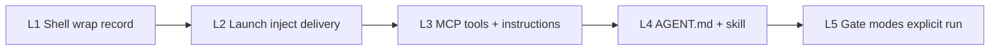
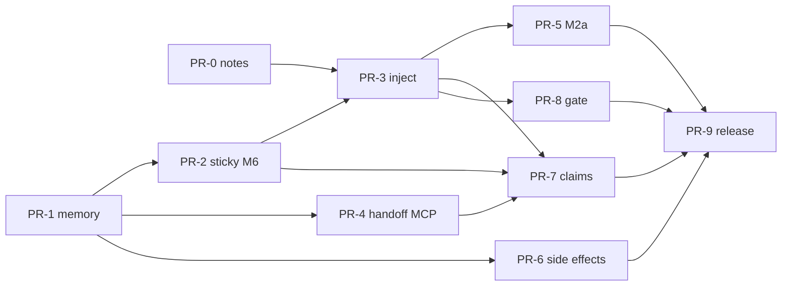

# Blackbox 1.2 — Agent Memory Bus (Continuity Plane)

> **Historical design document** (shipped). Operator entry: [../guide/what-is-blackbox.md](../guide/what-is-blackbox.md). Implementation: [../internals/continuity-plane.md](../internals/continuity-plane.md). Schema: [../reference/memory-pack.md](../reference/memory-pack.md).

| Field | Value |
|---|---|
| **Document** | Product + technical design for 1.2 |
| **Author** | TBD |
| **Date** | 2026-07-12 |
| **Status** | Ready for ship (rev 3 implemented in 1.2.0) |
| **Baseline** | blackbox-recorder **1.1.0** (adoption bar A1–A7 shipped) |
| **Target** | **1.2.0** single product cut when M-bar green (no 1.2.x train) |
| **Theme name (ROADMAP)** | **1.2 Agent Memory Bus / Continuity plane** |
| **North star** | Stop being a camera on the agent. Become the project's long-term memory bus: every blackbox launch path **materializes and injects** a bounded project memory pack so cooperative agents (and optional gates) cannot honestly start cold. |

---

## Overview

Blackbox 1.0 shipped the flight recorder. 1.1 proved ambient capture is safe and cheap enough to leave on. Agents still treat continuity as **opt-in/opt-remember**: call `blackbox handoff` if someone remembers; auto-resume only after sticky `attention_needed` or a failed/cancelled last run; successful-run WIP is nearly invisible; concurrent agents have no shared claim.

**1.2 reframes product identity:** project `enable` means **the default launch path delivers project memory into files, env, and (where possible) prompt preamble**—not merely "recording is available." The continuity plane is a **memory bus** between ephemeral agents (Claude → Grok → Codex CI → headless sandboxes).

**Honesty about "must":** blackbox cannot force a model to *read* injected context without OS DRM or vendor step-0 APIs. What we **can** make non-optional on blackbox-supervised paths is **delivery**: MEMORY files written, env set, compact preamble prepended when argv shape allows, MCP surfaces returning memory by default. Skipping then requires deliberate escape (`BLACKBOX_OFF`, `continuity=off`, or ignoring env/files). Gate modes can further block **explicit** `blackbox run` until ack—not ambient shell leave-on.

This design builds only on existing paths—`resume_inject`, `context`, `state`, `mcp`, `maybe_run`, shell install, status/handoff, capture layers—and extends them with always-on inject policy, project memory packs, a minimal locked claim, pack quality evaluation, and layered enforcement. No SaaS; secrets never at rest by default.

---

## Background & Motivation

### Current state (1.1.0, code-grounded)

| Surface | What exists | Continuity gap |
|---|---|---|
| **Capture** | PTY + Git/FS/Process layers (`src/capture/`), adapters (Claude/Codex/aider/gemini/cursor/opencode/grok), redact-before-write, SQLite schema v6 + blobs | Side effects beyond terminal/git/fs are sparse; Network/Browser event sources exist in the model but are not first-class capture layers |
| **Sticky state** | `.blackbox/state.json` via `ProjectState` (`src/state.rs`) — `last_run`, `last_failure`, `attention_needed` | Success clears attention unconditionally (lines 127–130); no intentional goal, open TODOs, or claim pointer |
| **Context packs** | `ContextPackView` (`src/context.rs`) — headline, next_action, attention_reason, failed_tools, errors_top, FS writes, transcript tail; A3 budget | Pack is **per-run resume**, not **project memory**. Success packs say "No failure attention required…" |
| **Auto-resume** | `prepare_resume_injection` (`src/resume_inject.rs`) → `RESUME.md`/`RESUME.json`, `BLACKBOX_RESUME_*` env, prompt prepend for claude/codex/aider/gemini/grok | **Only when** sticky attention or last_run failed/cancelled. Good-day restarts get nothing. Interactive TUI (no `-p`/`exec`) gets env+files only |
| **Notes on inject** | `RunSupervisor` sets `run.notes = auto_resume:…` then **overwrites** with `adapter:…` only (`src/run.rs` ~128–150) | Continuity audit trail via notes **does not persist today**—design must fix merge, not extend broken pattern |
| **Handoff / status** | `build_status` (`src/status.rs`); MCP `blackbox_handoff` prefers pack on attention; `--always` forces last-run pack | Agents can skip MCP entirely; skill/AGENT.md are advisory |
| **Ambient** | `maybe-run` decide order (`docs/ambient-contract.md`); shell wrappers never hard-fail | Ambient records; it does **not** force model context load |
| **Agent docs** | `.blackbox/AGENT.md`, `docs/skills/blackbox.md`, MCP `instructions` string | "Prefer handoff at session start" — agents ignore skills on good days |
| **Run graph** | `parent_run_id` column exists (schema v6); set primarily by replay fork (`src/replay/fork.rs`) | Not used for sequential agent handoff on normal run path |
| **Redaction counts** | Env redaction count on `environment.captured`; terminal `total_redactions` on final terminal event metadata (`src/run.rs`) | No run-level rollup field; pack can aggregate at build time |
| **Git summary** | `GitSummary` start/end commits only (`src/summary.rs`) | No dirty-tree flag today—memory builder must source dirty separately |

Key gate in today's inject path (`src/resume_inject.rs`):

```rust
// Only injects when attention_needed OR last_run failed/cancelled
if !sticky.attention_needed {
    let bad = sticky.last_run.as_ref()
        .map(|r| r.status == "failed" || r.status == "cancelled")
        .unwrap_or(false);
    if !bad { return Ok(None); }
}
```

Success + dirty tree + half-finished plan → **no inject**. That is the continuity failure.

### Pain points (from product honesty bar)

1. **Boot delivery is skippable** — if blackbox does not put memory on the launch path, agents will start cold on good days.
2. **Pack ≤ transcript** on success paths — humans paste session logs when packs only shine on failures.
3. **Invisible side effects** — destructive paths, redaction events, high-signal tool outcomes under-surfaced.
4. **Multi-agent is default reality** — without a shared claim + timeline, agent B redoes or clobbers A.
5. **Sessions are disposable** — CI, sandboxes, compacted context, lost harness session files.
6. **Silent failure cost is high** — fleets, paid evals, prod-adjacent agents need prod-log discipline.
7. **Trust must stay settled** — redaction structural IDs, no double-wrap, store self-limits (1.1 A2/A4).

### Why not "more subcommands"

Operators already have `status`, `handoff`, `context`, `postmortem`, MCP, serve APIs. The gap is **default path behavior**: enable → every supervised launch delivers memory; end-of-run → project memory updates; concurrent agents → claim conflict visible. Product shift is delivery + memory quality + minimal coordination, not CLI sprawl.

---

## Goals & Non-Goals

### Goals

1. **Session-start continuity delivery** in enabled projects via progressive enhancement (shell wrap → launch inject → MCP → skill/AGENT.md → optional gate on explicit `run`)—without requiring perfect harness-vendor cooperation.
2. **Always-on project memory** that survives successful runs: intentional state (explicit + minimal extractors), files touched, open TODOs (explicit/TODO markers), active claim, dirty tree, "do not retry" set.
3. **Minimal multi-agent claim** (one active project claim, locked acquire/release, conflict in pack)—not a distributed orchestrator.
4. **Pack quality that beats transcript on structural criteria (M2a)** for failure and success-WIP continuity.
5. **Side-effect substrate upgrades** only where they feed memory packs.
6. **Measurable must-bar (M1–M7)** for "default path cannot start cold without deliberate escape."
7. **Migration** from 1.1 ambient-on users with additive JSON, safe upgrade defaults, no silent flip on re-`enable --install-shell`.

### Non-goals

| Non-goal | Why |
|---|---|
| Forcing models to *read* injected context without cooperation or L5 ack gates | Not implementable without DRM / vendor step-0 |
| Full multi-tenant SaaS / remote multi-user ACLs | Unchanged quality bar; project-local store |
| Replacing harness UIs | Continuity plane, not conversation UI |
| Perfect vendor cooperation (system-prompt APIs) | Progressive enhancement |
| General-purpose agent orchestration (schedulers, DAGs, path-scoped locks, steal policies) | One project claim only in 1.2 |
| Guaranteeing interactive TUI agents emit machine-readable tool events | Best-effort adapters |
| Inventing cost estimates when pricing off | Keep 1.1 opt-in pricing |
| Global always-on recording without project enable | Ambient stays project-scoped |
| Perfect Windows interactive TUI parity as a release blocker | Soft/hard kill already in 1.1 |

---

## Must-have product thesis

### One sentence

**In an enabled project, every agent boot that goes through a blackbox launch path (wrap → record, `blackbox run`, or MCP handoff/memory tools) receives a bounded project memory pack on disk/env/(argv when possible) that is structurally more useful than replaying harness transcripts—and concurrent agents share one locked project claim so B cannot ignore A's active hold.**

### Product definition of "enable" (1.2)

| 1.1 meaning | 1.2 meaning |
|---|---|
| Recording is available; shell may wrap harnesses | **Default supervised launch materializes + injects project memory** (files/env/preamble), subject to OFF/nest/continuity mode |
| Attention is failure-centric | Attention includes **continuity**: dirty WIP, open claim, unresolved failure |
| Handoff is preferred | Handoff/MCP **return project memory by default** when project enabled |

### Measurable must-bar (M1–M7)

| # | Criterion | Target (ship gate) |
|---|---|---|
| **M1** | **Materialize + inject on blackbox launch paths** | Split write vs inject (see Inject pipeline norms). When project `enabled` and effective continuity ≠ off: **end-of-run always refreshes** MEMORY.md/json + RESUME copies. **Launch inject** (env + preamble + optional rewrite): `continuity=always` → every record launch; `continuity=attention` → only when sticky `attention_level != none`. Integration: `always` success → launch inject non-empty env/files; `attention` clean success → **no** launch inject env, but end-of-run file may still update. Harness coverage matrix below. **Not** "model read memory." |
| **M2a** | **Pack structural quality (CI-blocking)** | See evaluation suite: budget, shrink order, failure fields, success-WIP fields, next_action not success-noop string. |
| **M2b** | **Qualitative "beats transcript" (optional)** | Golden-file / offline judge later; **not** a 1.2.0 ship blocker. Marketing may say "designed to beat transcript" only after M2a green. |
| **M3** | **Side effects surface** | Pack includes ranked side-effect samples + `secret_redaction_events` count (not secret values); sources defined in Side-effect section. |
| **M4** | **Multi-agent claim MVP** | One active project claim; locked acquire so two concurrent processes → exactly one Active holder; release; pack surfaces claim + conflict string; soft attention (`continue`) on conflict unless `claim.policy=block_record`. |
| **M5** | **Sessions disposable** | With DB present: MEMORY is convenience cache; inject builds from store+sticky. **Degraded sticky-only pack** if store open fails (flag `degraded=true`). CI: `run --ci` + inject path with store. Full fidelity without DB is **not** required. |
| **M6** | **Silent failure discipline** | Deterministic attention algorithm (below); abandoned Running → Failed still; unrelated success does not clear unresolved failure without resolve/parent link. |
| **M7** | **Trust settled** | Redaction gate green on MEMORY paths; structural IDs unscarred; no double-wrap; retention defaults; doctor reports memory plane fields. |

Relationship to 1.1 A-bar: **A1–A7 remain permanent**. M-bar is additive.

#### M1 harness coverage matrix

| Class | Examples | Delivery strength |
|---|---|---|
| **Strong** | `claude -p` / `--print`, `codex exec <prompt>` | Env + MEMORY files + compact preamble prepended into prompt argv |
| **Weak** | aider / gemini / grok last non-flag arg (best-effort) | Env + files + best-effort last-arg prepend |
| **File/env only** | Interactive TUI (`claude` without `-p`), cursor/opencode without known prompt flag, unknown harnesses | Env + MEMORY files only; no argv mutation |
| **MCP path** | Client with `blackbox mcp` | Tools return `project_memory`; instructions urge step-0 call—**not** forced execution |
| **Escape** | `BLACKBOX_OFF`, nest `BLACKBOX_ACTIVE_RUN`, `continuity=off`, `--no-auto-resume` | No inject / passthrough per ambient contract |

---

## Proposed Design

### Architecture

```mermaid
flowchart TB
  subgraph enforce [Enforcement layers - progressive]
    Shell[Shell wrap maybe-run]
    Run[RunSupervisor launch]
    MCP[MCP instructions + tools]
    Skill[AGENT.md / skill]
    Gate[Gate modes - explicit run only]
  end

  subgraph plane [Continuity plane]
    MemBuild[build_project_memory]
    Pack[ProjectMemoryPack]
    Sticky[state.json sticky + claim]
    Store[(SQLite + blobs)]
    Lock[claims lock - flock or SQLite txn]
    Files[".blackbox/MEMORY.md + MEMORY.json + RESUME copies"]
  end

  subgraph capture [Existing capture]
    PTY[PTY I/O]
    Git[Git layer]
    FS[FS layer]
    Proc[Process layer]
    Adapter[Harness adapters]
    Analysis[SideEffect + ErrorDetector]
  end

  Shell --> Run
  Run --> MemBuild
  MCP --> MemBuild
  Gate --> Run
  MemBuild --> Store
  MemBuild --> Sticky
  MemBuild --> Lock
  MemBuild --> Pack
  Pack --> Files
  Run -->|inject env + preamble when strong/weak| Agent[Ephemeral agent]
  Files --> Agent
  MCP --> Agent
  PTY --> Store
  Git --> Store
  FS --> Store
  Proc --> Store
  Adapter --> Store
  Analysis --> MemBuild
  Run -->|end of run| Update[state.lock + apply_run_outcome + MEMORY refresh]
  Update --> Sticky
  Update --> Store
```



### Core concept: Project Memory Pack

Extend the resume pack from **single-run failure context** to **project continuity document**.

#### Schema (additive; keep `ContextPackView` for single-run)

New type `ProjectMemoryPack` in `src/memory.rs` (preferred over growing `context.rs` unbounded):

```text
schema: "blackbox.memory/v1"
purpose: "project-memory" | "for-resume" | "handoff"
degraded: bool                    # true if sticky-only / timeout / partial

project_root: string
store_db: string
generated_at: RFC3339
continuity_mode: "always" | "attention" | "off"

headline: string                  # never drop under budget
next_action: string               # never drop
attention_reason: string
attention_level: "none" | "info" | "continue" | "blocked"

intent: IntentView
claims: ClaimsSummaryView         # active + conflict strings only for MVP
last_run: RunPointer | null
predecessor_run: RunPointer | null  # at most one focus predecessor
focus_run_id: string | null

files_touched: [string]           # "kind:path" cap 40
destructive_paths: [string]       # cap 15
side_effects_top: [SideEffectSample]  # cap 12
secret_redaction_events: u32      # aggregate count, not secrets
# (removed env_mutations_suspected — was mis-signaling env redaction as mutation;
#  fold env redaction counts into secret_redaction_events only)
git: GitMemoryView                # dirty, branch?, head?, summary?
# git.porcelain_hash: optional short hash of porcelain text for cache debug only

failed_tools: [FailedTool]        # from focus run when applicable
errors_top: [ErrorTop]
summary: SummaryView | null       # focus run summary if built
last_tools: [string]
transcript_tail: string | null    # lowest priority; skip when attention_level=none
resume_command: [string] | null

approx_tokens: usize
truncated: bool
build_ms: u64                     # observability
```

#### IntentView

```text
goal: string | null
plan_summary: string | null
open_items: [string]              # cap 8
do_not_retry: [string]            # cap 5
notes: string | null
```

#### ClaimsSummaryView / ClaimPointer

```text
# ClaimsSummaryView
active: ClaimPointer | null
conflicts: [string]               # e.g. "project claim held by claude@host:12345 until 2026-07-12T18:00:00Z"

# ClaimPointer (sticky + pack)
id: string                        # uuid
holder: string                    # see holder algorithm
holder_kind: string               # "claude"|"codex"|"ci"|"human"|"unknown"
run_id: string | null
goal: string | null
acquired_at: RFC3339
expires_at: RFC3339
status: "active" | "released" | "expired"
```

#### GitMemoryView (new; not today's GitSummary alone)

```text
dirty: bool
branch: string | null
head: string | null               # short or full SHA
summary: string | null            # e.g. "3 modified, 1 untracked" porcelain summary
```

**Dirty source (normative):** at pack build, run `git status --porcelain` in `project_root` (best-effort; empty/fail → dirty=false, summary=null). Do **not** require extending `GitSummary` in MVP; optional later reuse of git capture end state if already available on last run without extra process spawn when building mid-run is too expensive—prefer one porcelain call with timeout (e.g. 500ms).

---

### Forced session-start **delivery** (not forced read)

#### Policy: `capture.continuity` (extends `auto_resume`)

In `.blackbox/config.toml`:

```toml
[capture]
# 1.1 compat: auto_resume still accepted
auto_resume = true                 # deprecated alias; serialized during transition
continuity = "always"              # always | attention | off  (explicit key)
resume_max_tokens = 4000
memory_max_tokens = 4000           # if unset, fall back to resume_max_tokens
gate_mode = "off"                  # off | warn | require_ack
auto_claim = false                 # default false for adoption
claim_ttl_secs = 1800              # 30 min when auto_claim used
claim_policy = "warn"              # warn | block_record
```

| Mode | Behavior |
|---|---|
| `always` | Every **record** launch builds + injects project memory (M1) |
| `attention` | Inject only when `attention_level != none` (1.1-compatible derived default) |
| `off` | No inject |

#### Config / env / CLI precedence (normative)

Highest wins:

1. CLI: `--no-auto-resume` → effective continuity **off** for this invocation; `--auto-resume` → this invocation behaves as **`continuity=always`** for inject (one-shot override, even if config is attention/off)
2. Env: `BLACKBOX_CONTINUITY=always|attention|off`
3. Env alias: `BLACKBOX_AUTO_RESUME=0|false|off|no` → off; `=1|true|on|yes` → if no continuity env, treat as **attention** (1.1 mental model: "resume on") not always
4. Config: explicit `capture.continuity` if key present in TOML
5. Config derived: if `continuity` key **absent**, `auto_resume=true` → `attention`, `auto_resume=false` → `off`
6. Defaults for **brand-new** config file written by first-time enable: `continuity=always`, `auto_resume=true`

When both `continuity` and `auto_resume` are present in config: **`continuity` wins**. CLI flags always win over env/config.

`memory_max_tokens`: config value if set; else `resume_max_tokens`; else 4000.

#### enable / re-enable migration (normative)

Matches today's `cmd_enable` behavior (load existing → set `enabled=true` → preserve other fields) with these rules:

| Situation | Continuity written |
|---|---|
| **Binary upgrade alone** (no enable) | No config rewrite. Effective mode derived at runtime: missing `continuity` key → from `auto_resume` (`true→attention`, `false→off`) |
| **New project** (no prior `config.toml`) | Write `continuity = "always"` and `auto_resume = true` |
| **Re-enable existing** (`blackbox enable` / `--install-shell`) | **Preserve** existing/derived continuity; do **not** silently flip to `always` |
| **Opt into memory bus** | `blackbox enable --continuity always` (or `--memory-bus` alias) writes `continuity=always` |
| **Serialize transition** | Writers emit both `auto_resume` and `continuity` keys |

#### Write vs inject norms (M1)

| Moment | `continuity=always` | `continuity=attention` | `continuity=off` |
|---|---|---|---|
| **End-of-run** | Always refresh MEMORY.md/json + RESUME copies | Always refresh MEMORY files (cheap cold-start cache) | No memory I/O |
| **Launch inject** (env, preamble, optional rewrite) | Always (including tiny ok packs when attention none) | Only if sticky `attention_level != none` | Never |

End-of-run write and launch inject are **separate code paths**. Attention-mode clean success: **no** `BLACKBOX_MEMORY_*` / preamble on next launch; disk file may still reflect last end-of-run refresh.

#### Focus / predecessor run selection (normative)

When building project memory or deciding `parent_run_id` inject linkage:

```text
1. If unresolved_failure_id is Some(fid) and store has run fid →
     focus_run = that failure run  (failed_tools / errors_top / failure summary slice)
2. Else →
     focus_run = last_run         (WIP files/tools from latest activity)
3. predecessor_run for inject parent_run_id = focus_run.id
   when attention_level ∈ {continue, blocked} (see parent_run rules)
4. files_touched / git dirty always reflect **live workspace + last ≤3 runs**,
   not only focus_run (WIP can coexist with an older unresolved failure)
```

Status `attention.run_id` follows the same priority: unresolved failure id if set, else last_run when wip/continue.

#### Inject pipeline (`src/resume_inject.rs` + `src/memory.rs`)

```text
prepare_continuity_injection(store, blackbox_root, opts) -> Option<ContinuityInjection>
  1. with_state_lock: load sticky (+ claim; expire if expires_at < now)
  2. If continuity off → None (no launch inject)
  3. If attention-only and attention_level == none → None
     (launch inject skipped; end-of-run may still have written MEMORY)
  4. build_project_memory(...) with performance limits
     (always re-run porcelain for dirty; see cache rules)
  5. Write MEMORY.md and MEMORY.json (launch-time rewrite OK when injecting)
  6. Write RESUME.md and RESUME.json as **identical content copies** (no symlinks)
  7. Return injection { file_path, preamble, pack, env, predecessor_run_id? }
```

`apply_to_launch`:

- Env: `BLACKBOX_RESUME_*` **plus** `BLACKBOX_MEMORY_FILE`, `BLACKBOX_MEMORY_SCHEMA=blackbox.memory/v1`, `BLACKBOX_CONTINUITY=1`
- Compact preamble: project headline + next_action + claim line; **delimited as untrusted prior context** (see Security)
- Harness matrix as in M1; argv cap ~1500 chars
- Full pack always on disk

#### Notes merge fix (prerequisite for audit trail)

**Bug today** (`src/run.rs` ~128–150): continuity note is set then clobbered by adapter-only assignment.

**Required fix** (PR-3 or small PR-0):

```rust
// Build notes once before insert_run:
// adapter:<id>[;insecure_raw][;continuity:<short>][;claim:<id>]
// Later session: append ";session:<sid>" via merge (existing finalize path already merges session).
```

Never assign `run.notes = Some(format!("adapter:…"))` in a way that drops prior segments. Prefer a small helper `fn merge_run_notes(existing: Option<String>, parts: &[&str]) -> String`.

#### `parent_run_id` rules (use column, not notes)

Set `run.parent_run_id = Some(predecessor_id)` **only when**:

- Continuity inject's focus/predecessor run has `attention_level` ∈ {`continue`, `blocked`}, **or**
- Active claim is transferred/rebound to this run from a prior holder run

**Do not** set parent on every always-mode success→success launch (avoids one infinite linked list for the whole project).

---

### Always-on project memory

#### Sticky state v2 (`src/state.rs`)

Logical schema `blackbox.state/v2` with **serde defaults** so v1 files load:

```rust
#[derive(Debug, Clone, Serialize, Deserialize)]
pub struct ProjectState {
    #[serde(default = "state_schema_default")]
    pub schema: String,                    // write "blackbox.state/v2"
    pub updated_at: DateTime<Utc>,
    pub last_run: Option<RunPointer>,
    pub last_failure: Option<RunPointer>,
    #[serde(default)]
    pub attention_needed: bool,            // derived on save; kept for v1 readers
    pub attention_reason: Option<String>,
    // v2 fields — all defaulted for v1 load
    #[serde(default)]
    pub attention_level: AttentionLevel,   // default None
    #[serde(default)]
    pub intent: IntentState,               // default empty
    #[serde(default)]
    pub active_claim: Option<ClaimPointer>,
    #[serde(default)]
    pub memory_updated_at: Option<DateTime<Utc>>,
    #[serde(default)]
    pub unresolved_failure_id: Option<String>,
}

#[derive(Debug, Clone, Default, Serialize, Deserialize)]
#[serde(rename_all = "snake_case")]
pub enum AttentionLevel {
    #[default]
    None,
    Info,
    Continue,
    Blocked,
}

#[derive(Debug, Clone, Default, Serialize, Deserialize)]
pub struct IntentState {
    pub goal: Option<String>,
    pub plan_summary: Option<String>,
    #[serde(default)]
    pub open_items: Vec<String>,
    #[serde(default)]
    pub do_not_retry: Vec<String>,
}
```

On every `save`, set `attention_needed = attention_level != None` so old parsers of sticky JSON and of `AttentionView.needed` keep working.

#### Project state lock (normative — all sticky RMW)

`active_claim` lives **inside** `state.json`. Claim-only locking is **insufficient**: an unlocked end-of-run `save` can rename over a concurrent claim acquire (lost Active holder).

**Rule:** every load→modify→save of `state.json` takes the **same** exclusive project lock:

| Path | Must lock |
|---|---|
| Claim acquire / release / heartbeat | Yes |
| End-of-run outcome apply (`apply_run_outcome`) | Yes |
| `blackbox resolve` / `memory set` / `ack` file is separate; resolve/memory set sticky writes | Yes |
| Read-only status/handoff pack build | Prefer lock for consistent snapshot; shared/read lock optional—MVP: brief exclusive OK |

**Lock file:** `.blackbox/state.lock` (single name; alias `claims.lock` not used—avoid two locks).

**Order (always):**

```text
acquire exclusive state.lock
  → load fresh state.json from disk
  → mutate in memory
  → atomic save (tmp + rename)
  → release lock
```

Never mutate from a stale in-memory copy taken before the lock. Helper: `with_state_lock(root, |state| { ... })`.

**Concurrency test (M4 extension):** process A holds Active claim; process B finishes a run under lock; final state still has A’s Active claim (unless B explicitly released/expired it). Two-process acquire exclusivity test remains.

#### M6 attention algorithm (deterministic MVP)

**Do not** implement M6 solely inside today’s `record_run(&Run)` (that API has no git/FS extras). Prefer a single entry point:

```rust
pub struct OutcomeExtras {
    pub git_dirty: bool,
    pub files_touched_nonempty: bool,
    pub claim_released: bool,       // true if this update released active_claim for R
    pub resolve_failure: bool,      // true if blackbox resolve path
    pub clear_wip: bool,            // true if resolve --clear-wip or memory set cleared items
}

/// Apply finished run under caller-held state lock (or acquire inside).
pub fn apply_run_outcome(state: &mut ProjectState, run: &Run, extras: OutcomeExtras);
```

`record_run(&run)` may remain as a thin wrapper for tests with `OutcomeExtras::default()` (git_dirty=false, etc.) or be deprecated.

**Call order at end-of-run (under `state.lock`):**

```text
1. load fresh state
2. release_or_rebind_claim(state, run)     # first so WIP step sees claim_released
3. compute extras (porcelain, FS scan from this run's events, claim_released flag)
4. apply_run_outcome(state, run, extras)  # M6 + last_run pointers + do_not_retry
5. merge_intent_extractors(state, run)    # lifecycle below; may clear auto open_items
6. save state
7. unlock
8. write_memory_files(...)                # outside lock OK if built from saved snapshot
```

**M6 steps inside `apply_run_outcome`:**

```text
INPUT: finished run R, prior state S (fresh under lock), OutcomeExtras E
OUTPUT: updated S

1. S.last_run = pointer(R)

2. If R.status ∈ {Failed, Cancelled}:
     S.last_failure = pointer(R)
     S.unresolved_failure_id = Some(R.id)
     S.attention_level = Continue   # Blocked only if claim.policy=block_record + conflict path
     S.attention_reason = Some("failed"|"cancelled" detail)
     # still fall through to do_not_retry / attention_needed; skip success clear

3. If R.status == Succeeded (or E.resolve_failure):
     if S.unresolved_failure_id is Some(fid):
       clear_failure =
         E.resolve_failure
         || R.parent_run_id == Some(fid)
         || R.tags contains "resolves:" + short_id(fid) or fid
       # NOTE: do NOT clear on unrelated success (e.g. blackbox run -- true)
       if clear_failure { S.unresolved_failure_id = None }

4. WIP signal (independent of failure):
     open = !S.intent.open_items.is_empty()
     claim_wip = S.active_claim is Active
                 && !E.claim_released
                 && (claim.run_id == Some(R.id) || claim still held by another)
     # If we just released our claim, claim_wip is false for that claim
     wip = open || E.git_dirty || E.files_touched_nonempty || claim_wip
     if E.clear_wip:
       S.intent.open_items.clear()  # goal lifecycle separate; see intent section
       recompute open = !S.intent.open_items.is_empty()
       wip = open || E.git_dirty || E.files_touched_nonempty || claim_wip

5. Recompute attention_level:
     if S.unresolved_failure_id.is_some():
       S.attention_level = Continue
       S.attention_reason = Some("unresolved_failure")  # unless step 2 set richer reason this run
     else if wip:
       S.attention_level = Continue
       S.attention_reason = Some("wip")
     else if R.status == Succeeded || E.resolve_failure:
       S.attention_level = None
       S.attention_reason = None
     else:
       # Running/Pending/Unknown: leave level as-is
       pass

6. S.attention_needed = S.attention_level != None
7. If R failed: merge do_not_retry fingerprints (cap 5, dedupe, rolling)
8. S.updated_at = now
```

**Dropped:** vague "same work unit completed." Failure clear paths are **only**: `blackbox resolve`, `parent_run_id` link to failure, or `resolves:<id>` tag.

**Acceptance tests (M6):**

1. Fail run A → attention Continue + unresolved=A; run `true` success unrelated → unresolved still A.
2. `blackbox resolve` → unresolved cleared; if no wip → None.
3. Fail A; run B with `parent_run_id=A` and success → unresolved cleared.
4. Success with dirty tree → Continue reason wip even if no failure.
5. Success clean + empty intent + no unresolved → None (requires open_items lifecycle clear, below).
6. Active claim held by A; concurrent B end-of-run under lock → claim still Active.

#### Intent extraction + clear/expire lifecycle

| Field | Source priority | MVP rules |
|---|---|---|
| `goal` | 1) explicit `memory set` / MCP 2) run `name` if present and goal empty 3) else keep prior | Explicit `memory set --goal ""` or `--clear-goal` clears |
| `plan_summary` | Explicit only | Explicit clear only |
| `open_items` | **Explicit only in MVP** (cleaner than auto TODO) | See lifecycle below |
| `do_not_retry` | Last K=3 failed runs' fingerprints `name + truncate(detail,80)`, dedupe, cap 5 | Rolling; no manual clear required |
| `files_touched` | FS events from last ≤3 runs (not sticky intent) | Ephemeral pack field |
| `dirty` | Live `git status --porcelain` | Ephemeral pack field |

**open_items lifecycle (normative):**

- **MVP: explicit-only.** Auto TODO/FIXME scan is **deferred** (optional post-1.2). Avoids forever-sticky false positives.
- `memory set --open a --open b` (or MCP): **replaces** entire list (not append), cap 8, redacted.
- `memory set --clear-open` or `--open` with empty list: clears open_items.
- `blackbox resolve --clear-wip`: clears open_items (and optional goal if `--clear-goal`); does not by itself clean git dirty.
- Success alone **does not** auto-clear open_items or goal (agent must clear or resolve --clear-wip).
- M6 test 5 uses empty open_items after explicit clear or never set.

**goal lifecycle:** retained across runs until explicit clear; success does not clear goal (intentional long-lived). Attention `wip` from goal alone is **false**—only open_items / dirty / files / claim force wip (goal is informational in headline).

Document in CLI help: after `--clear-open` + clean tree + no unresolved → `attention_level=none`.

#### End-of-run update path

Today: unlocked `state.record_run(&run)` + `save`. 1.2:

```text
with_state_lock(root):
  load fresh state
  release_or_rebind_claim(...)
  extras = OutcomeExtras { git_dirty, files_touched_nonempty, claim_released, ... }
  apply_run_outcome(&mut state, &run, extras)
  # intent extract: explicit-only; no auto open_items merge in MVP
  save state
write_memory_files(...)   # when continuity ≠ off; always refresh end-of-run
```

---

### Multi-agent coordination (collapsed MVP)

**1.2 MVP is intentionally small** to avoid lock-service / orchestration creep (Issue 21).

#### Single active project claim

- Storage: **`active_claim` on sticky state v2** is the source of truth for "who holds the project."
- Optional append-only history later; **not** required for M4.
- **Scope: project-wide only.** Path-scoped claims deferred (non-goal for 1.2).
- **No steal-except-expired admin API** beyond: if `expires_at < now`, treat as expired and allow acquire to replace.
- Heartbeat: only if `auto_claim=true`; on each continuity prepare or explicit `claim heartbeat`; extend `expires_at = now + claim_ttl_secs`.
- Transfer: `claim release` then next agent `claim acquire`; optional rebind `active_claim.run_id` when auto_claim on run start.

#### Mutual exclusion (required for M4)

Atomic rename alone is **insufficient** (two processes can both read empty and both write Active). Embedding claim in `state.json` also requires **every** sticky RMW to share one lock (see Project state lock)—not claim paths only.

**MVP lock strategy (pick one implementation; both acceptable):**

| Option | Mechanism |
|---|---|
| **A (preferred)** | `fcntl`/`flock` exclusive lock on **`.blackbox/state.lock`** around **all** sticky load-modify-save (claim + end-of-run + resolve + memory set) |
| **B** | SQLite: claim row and/or sticky mirror with `BEGIN IMMEDIATE` for every mutation that touches claim or sticky attention |

**Normative tests:**

1. Two concurrent acquire → exactly one Active holder.
2. Holder Active + concurrent finishing run → claim **not** dropped by end-of-run save.

File-only claims.json **without** lock is **rejected** for M4.

#### auto_claim defaults (adoption-safe)

| Setting | MVP default | Rationale |
|---|---|---|
| `auto_claim` | **`false`** | Solo interactive users must not get multi-hour stuck claims |
| Auto-on exceptions | `run --ci` may auto_claim=true for that invocation; or when `gate_mode != off` | Fleets opt into coordination |
| TTL | 1800s (30 min) when used | Short; release in `RunSupervisor` finally/drop path always |
| Conflict pack level | `attention_level=continue` + conflicts string | Soft; never block harness start unless `claim.policy=block_record` **and** path is explicit `blackbox run` (not maybe-run) |

#### API surface (minimal)

| Surface | Operations |
|---|---|
| CLI | `blackbox claim acquire\|release\|status` (heartbeat optional subcommand) |
| MCP | `blackbox_claim` with `action=acquire|release|status` |
| Pack | `claims.active` + `claims.conflicts` |
| Auto | Only if auto_claim enabled for invocation |

**Not in 1.2:** path scopes, multi-claim queues, transfer flags beyond release+acquire, mid-run heartbeat threads (heartbeat on prepare is enough).

---

### Pack quality that beats transcript (M2a)

#### Build order (budget priority — never drop under budget)

1. `headline`, `next_action`, `attention_reason`, `attention_level`
2. Active claim + conflicts
3. `intent` (goal, open_items, do_not_retry — already capped)
4. Focus run `failed_tools` + `errors_top`
5. `files_touched` + `destructive_paths` + git dirty summary
6. `side_effects_top` + `secret_redaction_events`
7. `predecessor_run` pointer
8. `last_tools`
9. `transcript_tail` (first to shrink/drop; **skip entirely when `attention_level=none`**)

#### M2a CI rubrics (`tests/memory_pack_quality.rs`)

| # | Fixture | Pass criteria |
|---|---|---|
| 1 | Failed run with Bash error | non-empty headline/next_action; attention_level ≥ continue; failed_tools non-empty; approx_tokens ≤ max |
| 2 | Failed + huge transcript, max_tokens=500 | failed_tools retained; transcript gone or &lt;200 chars; truncated=true |
| 3 | Success + FS writes + porcelain dirty | attention_level != none; files_touched non-empty OR git.dirty; next_action **must not** equal or contain the 1.1 success noop `"No failure attention required"` |
| 4 | Success clean empty intent | may be attention none; pack still non-empty headline; approx_tokens ≤ 400 |
| 5 | Planted secret in tool output | MEMORY.json after redact path contains zero planted secret substrings; structural UUID/SHA survive |
| 6 | Shrink order unit | under forced tiny budget, transcript/last_tools drop before headline/intent/failed_tools |

**M2b (optional, not ship gate):** golden-file narrative quality; offline LLM judge.

#### Performance budgets (always-on pack build)

| Limit | Value |
|---|---|
| Runs scanned | last **≤ 3** |
| Events per run | **≤ 2000** (`get_events_limited`) |
| Transcript | skip if `attention_level=none`; else rebuild only focus run, already lowest priority |
| Git porcelain | timeout **500ms**; on fail dirty=false |
| Soft wall time | **Pack assemble after inputs ready** ≤ 100ms p95 on tiny fixtures (**excludes** porcelain and store open). Do **not** CI-fail on 100ms including porcelain. |
| Real overhead gate | Extend `overhead_smoke` / `continuity_overhead`: `continuity=always` + `run -- true` wall delta vs bare **≤ +50ms** (or document measured budget)—this is the A6-aligned gate |
| Hard degrade | If total build exceeds **2s**, return degraded sticky-only pack (`degraded=true`) |

#### Pack cache rules (no stale dirty/WIP)

Full-file cache reuse based only on sticky/last_run mtime is **unsafe**: file edits after the last blackbox run do not bump sticky, so a cached `git.dirty=false` pack would lie.

**Normative cache policy:**

1. **Always re-run** `git status --porcelain` (≤500ms) on every pack build used for launch inject or handoff when continuity ≠ off—**except** skip porcelain when building **attention-none tiny ok packs** if sticky says clean intent and caller opts `skip_porcelain_if_none` (end-of-run just wrote clean; optional micro-opt).
2. **Never** serve a cached pack’s `git` / dirty / `files_touched` without merging live porcelain (prefer: **do not cache** those fields—recompute and merge into any structural cache).
3. **Simplest MVP (preferred):** no pack cache on launch inject—always rebuild with limits; rely on ≤3 runs / ≤2k events / skip transcript on none. Add structural cache later only with rule (2).
4. **Claim expiry:** if `active_claim.expires_at < now`, treat claim expired under lock, clear/replace, and **force** rebuild (never cache past expiry).
5. If a structural cache is added later, invalidate when: sticky.updated_at changes, last_run id changes, claim id/expiry changes, or porcelain hash ≠ previous.

---

### Side-effect substrate upgrades

| Upgrade | Source | Pack field |
|---|---|---|
| Ranked side effects | `SideEffectClassifier` on tool/process events from last ≤3 runs | `side_effects_top` (Destructive > ExternalWrite > LocalWrite) |
| Destructive paths | Classifier + FS events | `destructive_paths` |
| Redaction events | Aggregate `metadata.redactions` / `total_redactions` from env + terminal events of focus run | `secret_redaction_events: u32` (redaction applications observed; includes env secret redactions) |
| Env “mutation” | **Not in MVP** — env redaction count is **not** mutation; do not emit `env_mutations_suspected` | fold into `secret_redaction_events` only |
| Command inventory | tool Bash / process names top N | via side_effects_top detail |

**Out of scope:** network sniffer, browser CDP, eBPF, run-level new SQLite columns for redaction counts (aggregate at pack time).

---

### Enforcement layers (progressive enhancement)



| Layer | Mechanism | Strength |
|---|---|---|
| **L1** | `maybe-run` record when wrap hits | Ensures capture + inject **path** runs |
| **L2** | MEMORY files + env + preamble per harness matrix | Strong/weak/file-only as tabled |
| **L3** | MCP instructions + tools always return memory when enabled | Advisory tool call order |
| **L4** | AGENT.md / skill memory-first wording | Advisory |
| **L5** | `gate_mode` on **explicit `blackbox run` only** | See below |

#### L5 gate modes vs ambient leave-on (normative)

| Path | `gate_mode=warn` | `gate_mode=require_ack` |
|---|---|---|
| **`blackbox run`** (explicit) | stderr warning + pack flag; child starts | Child **does not start** until `blackbox ack` or `BLACKBOX_ACK=1` (after operator/agent read handoff) |
| **`maybe-run` / shell wrap** | stderr warning only if TTY/log allows; **never blocks harness** | **Treat as warn only** — do **not** refuse to start `claude`/`codex`/… |
| Binary missing | Ambient contract: bare command | Unchanged |

Fleet hard-gating: wrap CI with `blackbox run --ci` or a pre-step `blackbox handoff && export BLACKBOX_ACK=1`, **not** ambient shell functions. Ambient contract tests must remain green (A1).

#### MCP changes (`src/mcp.rs`)

```text
initialize.instructions:
  "Enabled project: call blackbox_handoff or blackbox_memory before other work.
   Prefer project_memory over re-reading transcripts. Honor active claims."

Tools:
  blackbox_memory      — always project memory pack when store/project present
  blackbox_claim       — acquire|release|status
  blackbox_resolve     — clear unresolved failure
  blackbox_memory_update — set goal/open_items (redacted)

Upgrade blackbox_handoff:
  When project enabled, attach project_memory by default (not only attention).
  Keep resume_pack as focus-run pack alias when a focus run exists.
```

#### Shell / enable

- First-time enable: `continuity=always`, refresh AGENT.md
- Re-enable: preserve continuity (see migration)
- `enable --continuity always` / `--memory-bus` to opt in
- Install-shell A1 contract unchanged

---

## API / Interface Changes

### CLI (additive)

| Command | Change |
|---|---|
| `status` / `handoff` | Add `project_memory`; keep `resume_pack` for focus run; extend `attention` with `level` |
| `context --for-resume` | Unchanged single-run pack |
| `memory show` / `context --project-memory` | Project memory pack |
| `memory set --goal …` | Update intent (redacted) |
| `resolve [run]` | Clear unresolved failure (default latest unresolved) |
| `claim acquire\|release\|status` | Project claim |
| `ack` | MVP ack contract below |
| `memory set` | `--goal`, `--open` (replace list), `--clear-open`, `--clear-goal` |
| `resolve` | Clear unresolved failure; optional `--clear-wip` |
| `run` / `maybe-run` | Continuity inject; auto_claim only if configured; gate per L5 table |
| `enable` | New projects always; re-enable preserves; `--continuity` flag |

#### `ack` / require_ack contract (MVP)

| Mechanism | Behavior |
|---|---|
| `BLACKBOX_ACK=1` | Satisfies gate for **this** explicit `blackbox run` process only (env present at start). No multi-run stickiness. |
| `blackbox ack` | Writes `.blackbox/ack` with `{ "ts": RFC3339 }`. Next explicit `blackbox run` under `require_ack` **consumes** the file (delete after accept). Single-slot; no queue. |
| Expiry | Optional: ignore ack file older than 1 hour; force re-ack. |
| maybe-run | Never consults ack (warn-only path). |

Either env **or** unexpired ack file satisfies require_ack; both not required.

### AttentionView compatibility

```rust
pub struct AttentionView {
    pub needed: bool,                    // = level != None (always derived)
    pub level: AttentionLevel,           // additive field; serde default None for old readers N/A (we produce)
    pub reason: Option<String>,
    pub run_id: Option<String>,
}
```

Old agents checking only `attention.needed` keep working.

### StatusView

Additive fields on existing `StatusView` (both status and handoff):

- `attention.level`
- `project_memory: Option<ProjectMemoryPack>`
- `resume_pack` remains `Option<ContextPackView>` for focus run (handoff/attention paths)

**Alias rules:**

| Field | When present |
|---|---|
| `project_memory` | Project enabled and pack built (handoff always tries when enabled; status when `--resume` or attention or always-on config for handoff tool) |
| `resume_pack` | Focus run pack when attention targets a run **or** force_resume / handoff always; may be nested subset of failure slice already inside project_memory |

### JSON envelope example (handoff)

```json
{
  "ok": true,
  "schema": "blackbox.cli/v1",
  "command": "handoff",
  "data": {
    "enabled": true,
    "attention": {
      "needed": true,
      "level": "continue",
      "reason": "wip",
      "run_id": "aaaaaaaa-bbbb-cccc-dddd-eeeeeeeeeeee"
    },
    "project_memory": {
      "schema": "blackbox.memory/v1",
      "purpose": "handoff",
      "degraded": false,
      "headline": "WIP: 3 files dirty after run aaaaaaaa",
      "next_action": "Continue from open items; do not redo ApplyPatch on src/foo.rs",
      "attention_level": "continue",
      "attention_reason": "wip",
      "intent": {
        "goal": "Fix login redirect",
        "plan_summary": null,
        "open_items": ["Add test for redirect"],
        "do_not_retry": ["Bash: permission denied on /etc/shadow"]
      },
      "claims": {
        "active": null,
        "conflicts": []
      },
      "files_touched": ["filesystem.write:src/auth.rs"],
      "secret_redaction_events": 2,
      "git": { "dirty": true, "branch": "main", "head": "abc1234", "summary": "2 modified" },
      "approx_tokens": 800,
      "truncated": false
    },
    "resume_pack": null
  }
}
```

### Env vars

| Var | Role |
|---|---|
| `BLACKBOX_CONTINUITY` | always / attention / off |
| `BLACKBOX_AUTO_RESUME` | 1.1 alias (see precedence) |
| `BLACKBOX_MEMORY_FILE` | Path to MEMORY.md |
| `BLACKBOX_RESUME_FILE` | Compat path |
| `BLACKBOX_ACK` | `=1` satisfies require_ack for this explicit `run` process only |
| `BLACKBOX_OFF` / `BLACKBOX_ACTIVE_RUN` | Unchanged |
| `BLACKBOX_CLAIM_HOLDER` | Optional override for holder id |

### Holder id algorithm

```text
if BLACKBOX_CLAIM_HOLDER set → use it (redact, max 128 chars)
else if run.session_id known at acquire time → "{adapter|unknown}:{session_id}"
else → "{basename(hostname)}:{pid}"
holder_kind ← adapter id if known else "ci" if --ci else "unknown"
```

### Files on disk

```text
.blackbox/
  config.toml
  state.json              # sticky v2 (includes active_claim)
  state.lock              # flock for ALL sticky RMW (claim + end-of-run + resolve + memory set)
  ack                     # optional single-use require_ack token
  MEMORY.md / MEMORY.json
  RESUME.md / RESUME.json # identical copies, not symlinks
  AGENT.md
  blackbox.db / blobs/
```

---

## Data Model Changes

### Sticky state

- `blackbox.state/v2` with serde defaults for all new fields
- Upgrade-on-write; v1 load must not fail

### Claims

- MVP: claim pointer **inside sticky**, mutations under **shared `state.lock` or SQLite IMMEDIATE** covering **all** sticky writes (not claim-only)
- Optional schema v7 `claims` table only if choosing option B; not required if flock+sticky

### Runs

- Fix notes merge
- Set `parent_run_id` only per rules above

### Events (optional audit)

- `continuity.injected`, `claim.acquired`, `claim.released`, `memory.updated` — nice-to-have, not ship-blocking

### Migration

1. Read: state v1 → defaults for v2 fields  
2. Config: derive continuity when key absent; no rewrite on upgrade alone  
3. Existing ambient users: stay on **attention** until `--continuity always`  
4. DB: stay on v6 for flock MVP  

---

## Alternatives Considered

### Alt A — MCP-only forced handoff

Rely on MCP instructions alone. **Reject:** CI/CLI agents never see MCP; instructions are advisory.

### Alt B — Harness session files as continuity plane

**Reject:** disposable sessions; multi-harness mismatch; secrets risk.

### Alt C — Full orchestration platform

**Reject:** violates non-goals.

### Alt D — Always inject only on failure (status quo)

**Reject** as default product thesis; remain available as `continuity=attention`.

### Alt E — Write MEMORY end-of-run only; inject only on attention

| Pros | Cons |
|---|---|
| Cheaper launches | Fails M1 always-delivery; cold starts still skip |

**Reject** as sole design; end-of-run write is **additive** cache, not instead of inject when continuity=always.

### Alt F — Project file drop-in (CLAUDE.md / AGENTS.md fragment) as L2b

| Pros | Cons |
|---|---|
| Interactive TUI may auto-read project files | Pollutes user-owned docs; surprising; vendor-specific |

**Accept as optional progressive enhancement later**, not MVP. Prefer `.blackbox/MEMORY.md` + env. Document that users may copy next_action into their own harness docs.

### Alt G — SQLite-first claims vs flock+sticky

| SQLite IMMEDIATE | flock + sticky |
|---|---|
| Strong txn semantics; queryable | No schema bump; matches state.json |
| Needs migration v7 | Windows flock nuances (document; PowerShell path best-effort) |

**Either OK for M4**; prefer flock+sticky for MVP speed unless Windows lock pain appears—then SQLite.

### Alt H — Path-scoped claims

**Defer:** orchestration creep; MVP project-scoped only.

---

## Security & Privacy Considerations

| Threat | Mitigation |
|---|---|
| Secrets in MEMORY | Redact-before-write via `SecretScanner` on all intent/memory text; never raw env values; redaction_gate on MEMORY.json |
| Claim spoof | Local trust; holder advisory; not a security boundary |
| Gate bypass | `BLACKBOX_OFF` preserved; gate not DRM |
| Transcript leakage | Skip transcript when attention none; lowest budget priority |
| Store growth | Overwrite memory files; retention on runs/blobs |
| Concurrent claim race | Shared **state.lock** (or SQLite IMMEDIATE) on **all** sticky RMW—not claim-only |
| Lost claim via end-of-run save | Same lock; load-fresh-under-lock; concurrency test holder survives |
| **Prompt injection via MEMORY** | Memory is **untrusted prior context**. MVP: (1) wrap compact preamble in delimiters (below); (2) never replace user argv prompt—only prepend; (3) hard size cap; (4) secret redaction. **Defer** regex "ignore previous instructions" stripping as non-goal unless trivial. Document risk for high-trust fleets. |

#### Preamble delimiter (normative)

```text
<<<BLACKBOX_UNTRUSTED_MEMORY>>>
[blackbox memory] {headline}
next: {next_action}
claim: {claim one-liner or "none"}
full: {MEMORY_FILE path}
<<<END_BLACKBOX_UNTRUSTED_MEMORY>>>
```

---

## Observability

### Doctor JSON (additive)

```json
{
  "continuity_mode": "always",
  "memory_file_present": true,
  "memory_age_secs": 120,
  "claims_active": false,
  "unresolved_failure_id": null,
  "attention_level": "none",
  "storage_warning": null
}
```

Warn if `enabled && effective_continuity == "off"`.  
Warn if memory_age_secs high and git dirty (best-effort).

### Other signals

- tracing: inject yes/no, mode, build_ms, degraded, token size  
- optional events: continuity.injected, claim.*  
- tests: memory_pack_quality, claim concurrency, continuity inject success, ambient gate non-block  

---

## Rollout Plan

### Defaults

| Flag | New project enable | Existing config (upgrade) |
|---|---|---|
| `continuity` | `always` | Derived `attention` if auto_resume true and key absent |
| `auto_claim` | `false` | `false` |
| `gate_mode` | `off` | `off` |

### Stages → single **1.2.0** cut

1. Pack builder + sticky v2 + M6 algorithm  
2. Always inject (new projects / opt-in) + notes fix + performance limits  
3. Handoff/MCP/skill surfaces  
4. M2a test suite  
5. Side-effect rollups + secret_redaction_events  
6. Locked claim MVP  
7. resolve CLI + parent_run rules  
8. Gate modes (explicit run only)  
9. Docs + version 1.2.0 when M-bar green  

**No 1.2.x train** (aligns with ROADMAP "one product release at a time").

### Rollback

- `continuity=off` or `BLACKBOX_AUTO_RESUME=0`  
- Clear active_claim / ignore lock file  
- Binary downgrade: v1-compatible sticky fields remain  

---

## Open Questions

1. **flock vs SQLite for claim lock on Windows** — implement flock on `state.lock` first; fall back to SQLite v7 if Windows CI fails exclusivity test.  
2. **Should tiny ok packs inject on every always-mode success?** **Yes** for M1 proof (~≤400 tokens, attention none, no transcript). Attention-mode clean success: no launch inject.  
3. **CLAUDE.md L2b** — deferred; track as post-1.2 progressive enhancement.  
4. **Auto TODO open_items** — **deferred**; MVP explicit-only. Revisit only if explicit tools prove too weak.

---

## References

| Doc / path | Role |
|---|---|
| `docs/ROADMAP.md` | Quality bar; A-bar; versioning decision |
| `docs/plan/adoption-1.1.md` | Prior theme pattern |
| `docs/ambient-contract.md` | maybe-run order (preserve) |
| `docs/agent-api.md` | Additive contracts |
| `src/resume_inject.rs` | Inject gate + apply_to_launch |
| `src/context.rs` | ContextPackView + A3 |
| `src/state.rs` | Sticky + AGENT.md |
| `src/status.rs` / `src/mcp.rs` | Handoff surfaces |
| `src/maybe_run.rs` / `src/shell_install.rs` | Ambient L1 |
| `src/run.rs` | Notes clobber bug; redaction counts; launch |
| `src/cli.rs` `cmd_enable` | Preserve-on-re-enable pattern |
| `src/analysis/classifier.rs` | SideEffect labels |
| `src/replay/fork.rs` | parent_run_id pattern |
| `src/storage/sqlite.rs` | Schema v6 |

---

## Risks

| Risk | Severity | Mitigation |
|---|---|---|
| Agents ignore MEMORY/env | High | Strong inject where possible; pack quality; optional require_ack on explicit run |
| Always inject latency | Med | Limits, cache, skip transcript on none, degraded path |
| Claim friction / stuck claims | Med | auto_claim default false; 30m TTL; soft conflicts; finally release |
| Forever-sticky open_items | Med | Explicit-only MVP; clear-open / resolve --clear-wip |
| Stale MEMORY dirty cache | Med | No full-file cache; always live porcelain on inject |
| require_ack kills ambient leave-on | High | **Never block maybe-run** |
| Re-enable flips continuity | High | Preserve on re-enable; explicit flag to opt in |
| Memory prompt injection | Med | Delimiters, prepend-only, redact, size cap |
| Scope creep to orchestrator | Med | Collapsed claim MVP; project scope only |
| Notes audit trail lost | Med | Fix merge before relying on notes; prefer parent_run_id |

---

## Key Decisions

| Decision | Choice | Rationale |
|---|---|---|
| Product theme | **1.2 Agent Memory Bus / Continuity plane** | Camera→memory reframe |
| "Force" language | **Deliver/inject on launch paths**, not "force model read" | Honesty vs A5; L1–L5 reality |
| M1 metric | Materialize files+env+preamble per harness matrix | Testable without model cooperation |
| M2 | **M2a structural CI only** for ship; M2b optional | A3 lesson |
| Continuity default new project | `always` | Product thesis |
| Continuity upgrade / re-enable | Derive attention; **preserve** on re-enable; `--continuity always` opt-in | No silent flip for install-shell users |
| Precedence | CLI > env > config continuity > derived auto_resume > defaults | Clear implementer rules |
| Sticky attention | Deterministic M6 via `apply_run_outcome` + OutcomeExtras | Implementable; testable |
| State concurrency | **All** sticky RMW under shared `state.lock` | Claim + end-of-run cannot clobber each other |
| Intent MVP | **Explicit-only** open_items; clear via memory set / resolve --clear-wip; no auto TODO | Avoid forever-sticky WIP |
| Dirty tree | Live porcelain every pack build (no stale full-file cache) | M2a success-WIP truth |
| Focus run | unresolved_failure_id first, else last_run | Failure slice + WIP coexist |
| Multi-agent | **One project claim** under same state.lock; sticky pointer | M4 real exclusion |
| auto_claim default | **false** | Protect ambient leave-on |
| Claims scope | Project-only; no path scopes / steal APIs | Non-goal boundary |
| parent_run_id | Only attention≥continue inject or claim rebind; predecessor=focus | Avoid full-project linked list |
| Notes | **Fix clobber**; merge adapter+continuity+claim | Real run.rs bug |
| RESUME files | **Identical copies**, never symlinks | Windows/CI |
| Redaction field | `secret_redaction_events` only; no env_mutations_suspected | Avoid false "mutation" signal |
| require_ack | Explicit run only; ACK env one-shot or single-use ack file | Protect A1; no bikeshed queue |
| CLI `--auto-resume` | Forces this invocation to continuity=always inject | Clear override |
| M1 write vs inject | End-of-run always writes; launch inject per mode | Attention clean ≠ always inject |
| Performance | ≤3 runs / ≤2k events; no unsafe cache; porcelain excluded from 100ms soft | Protect A6 |
| Release | Single **1.2.0** cut | ROADMAP versioning |
| Secrets / injection | Redact; untrusted delimiters; prepend-only | Quality bar + new attack surface |
| Doctor | Concrete continuity/memory/claim fields | M7 |

---

## PR Plan

Independently reviewable PRs; single 1.2.0 release when exit criteria met. Early value: inject delivery + packs before multi-agent.

### PR-0 — Notes merge fix (tiny, preferably first)

- **Title:** `fix(run): merge run notes instead of clobbering auto_resume`
- **Files:** `src/run.rs`, unit test
- **Dependencies:** none
- **Description:** Fix adapter notes overwrite so continuity/session segments survive. Prerequisite for honest audit trail.

### PR-1 — Project memory pack builder (schema + budget + limits)

- **Title:** `feat(memory): project memory pack schema and builder`
- **Files:** `src/memory.rs`, `src/lib.rs`, unit tests
- **Dependencies:** none (coordinate field names with PR-6)
- **Description:** `ProjectMemoryPack`, budget order, performance limits (3 runs / 2k events / skip transcript on none), degraded flag. Keep `ContextPackView`.

### PR-2 — Sticky state v2 + M6 algorithm + state.lock + end-of-run memory files

- **Title:** `feat(state): sticky v2, apply_run_outcome, state.lock, MEMORY files`
- **Files:** `src/state.rs` (`with_state_lock`, `apply_run_outcome`, `OutcomeExtras`), `src/cli.rs` post-execute, tests for M6 + lock vs concurrent save, `blackbox resolve` / `memory set` thin CLI
- **Dependencies:** PR-1
- **Description:** Serde defaults; M6 via `apply_run_outcome` (not bare `record_run`); **all sticky RMW under `state.lock`**; explicit-only open_items lifecycle; end-of-run always refresh MEMORY when continuity ≠ off; resolve + `--clear-wip`.

### PR-3 — Continuity inject (always/attention) + config precedence + enable rules

- **Title:** `feat(continuity): launch inject project memory with safe defaults`
- **Files:** `src/resume_inject.rs`, `src/config.rs`, `src/cli.rs` (run + enable flags), `src/run.rs` parent_run_id optional hook, `docs/agent-api.md`, integration tests M1
- **Dependencies:** PR-0, PR-1, PR-2
- **Description:** Continuity modes; precedence table; new enable writes always; re-enable preserves; `--continuity`; harness matrix; env MEMORY_*; parent_run only when attention≥continue; overhead smoke delta.

### PR-4 — Status/handoff/MCP/skill surfaces

- **Title:** `feat(handoff): project_memory on status/MCP with attention.level`
- **Files:** `src/status.rs`, `src/mcp.rs`, `src/serve.rs`, skills, `agent_instructions_markdown`, docs
- **Dependencies:** PR-1 (PR-2 preferred)
- **Description:** Additive AttentionView.level; project_memory; MCP tools memory/resolve/memory_update; handoff default memory when enabled. **Does not claim M1 green until PR-3.**

### PR-5 — M2a pack quality suite

- **Title:** `test(memory): M2a structural pack quality gate`
- **Files:** `tests/memory_pack_quality.rs`
- **Dependencies:** PR-1–PR-3
- **Description:** CI-blocking rubrics table; redaction assertion; budget order.

### PR-6 — Side-effect rollups + secret_redaction_events

- **Title:** `feat(analysis): side-effect rollups and redaction event counts for packs`
- **Files:** `src/analysis/classifier.rs`, `src/memory.rs`, tests
- **Dependencies:** PR-1 (field names stable)
- **Description:** M3 signals; aggregate existing redaction metadata; no sniffer.

### PR-7 — Locked project claim MVP

- **Title:** `feat(claims): single project claim under shared state.lock`
- **Files:** `src/claims.rs` (or state helpers), CLI/MCP claim, sticky active_claim, concurrency tests
- **Dependencies:** PR-2 (`state.lock` infrastructure), PR-3 (auto_claim on launch), PR-4 for MCP
- **Description:** acquire/release via same lock as end-of-run; auto_claim default false; soft conflicts; finally release; tests: (1) two-process exclusive acquire (2) Active claim survives concurrent end-of-run. No path scopes.

### PR-8 — Gate modes (explicit run only)

- **Title:** `feat(gate): warn/require_ack for explicit blackbox run`
- **Files:** `src/cli.rs` run preflight, config, `ack` command, tests proving maybe-run never blocked
- **Dependencies:** PR-3
- **Description:** L5 table; `BLACKBOX_ACK=1` one-shot; `blackbox ack` single-use file consumed by next run; ambient_contract remains green.

### PR-9 — Docs, ROADMAP 1.2 theme, migration, release 1.2.0

- **Title:** `docs(1.2): Agent Memory Bus + migration from 1.1`
- **Files:** `docs/ROADMAP.md`, land design under `docs/plan/`, README, CHANGELOG, agent-api, AGENTS.md, version bump
- **Dependencies:** PR-0…PR-8 as required for exit criteria
- **Description:** Theme name, M-bar, migration one-liner, non-goals. Cut **1.2.0** once exit criteria met—**no train**.

### Dependency graph



### Exit criteria (ship 1.2.0)

- [ ] M1 Write vs inject norms + harness matrix (`always` inject on success; `attention` clean skips launch inject)  
- [ ] M2a Pack quality suite green (M2b not required); live dirty not stale-cached  
- [ ] M3 Side-effect + secret_redaction_events in pack (no env_mutations_suspected)  
- [ ] M4 Claim under shared state.lock: exclusive acquire + claim survives concurrent end-of-run  
- [ ] M5 CI inject with store; degraded sticky-only defined  
- [ ] M6 `apply_run_outcome` tests (unrelated success, resolve, parent, wip, clear-open → none)  
- [ ] M7 Redaction gate + doctor memory plane fields  
- [ ] A1–A7 still green (maybe-run never blocked by require_ack)  
- [ ] Notes merge fixed; parent_run + focus selection documented in code  
- [ ] Additive agent API; RESUME copies; auto_resume compat  
- [ ] `cargo test` / `cargo clippy --all-targets -- -D warnings` clean  
- [ ] ROADMAP/README/CHANGELOG honest (delivery ≠ model forced-read)  

---

## Migration story (1.1 ambient-on → 1.2)

1. **Upgrade binary alone** — no config rewrite; effective `continuity=attention` if `auto_resume` true (default). Behavior matches 1.1 inject gate intent (attention/failure), plus sticky v2 fields when written.  
2. **Re-run `enable --install-shell`** — still **preserves** continuity; does not flip to always.  
3. **Opt into memory bus:**
   ```bash
   blackbox enable --continuity always
   # or: blackbox enable --memory-bus
   ```
4. **Verify:**
   ```bash
   blackbox handoff --json    # project_memory + attention.level
   blackbox doctor --json     # continuity_mode, memory_file_present, …
   ```
5. **Fleet/CI hard gate:** use `blackbox run --ci` + optional `require_ack` / `BLACKBOX_ACK`; do not rely on ambient shell to block.  
6. **Rollback:** `continuity=off` or `BLACKBOX_AUTO_RESUME=0`.

---

## Appendix A: Example MEMORY.json (success WIP)

```json
{
  "schema": "blackbox.memory/v1",
  "purpose": "project-memory",
  "degraded": false,
  "continuity_mode": "always",
  "headline": "WIP after aaaaaaaa: dirty tree, 2 files touched",
  "next_action": "Continue goal if set; review files_touched; blackbox handoff --json",
  "attention_level": "continue",
  "attention_reason": "wip",
  "intent": {
    "goal": null,
    "plan_summary": null,
    "open_items": [],
    "do_not_retry": []
  },
  "claims": { "active": null, "conflicts": [] },
  "files_touched": ["filesystem.write:src/lib.rs", "filesystem.write:tests/t.rs"],
  "destructive_paths": [],
  "side_effects_top": [],
  "secret_redaction_events": 0,
  "git": {
    "dirty": true,
    "branch": "main",
    "head": "deadbeef",
    "summary": "2 modified"
  },
  "failed_tools": [],
  "errors_top": [],
  "transcript_tail": null,
  "approx_tokens": 220,
  "truncated": false,
  "build_ms": 35
}
```

## Appendix B: Code anchors (implementer map)

| Concern | Primary symbols |
|---|---|
| Inject gate | `resume_inject::prepare_resume_injection`, `auto_resume_enabled` |
| Launch apply | `resume_inject::apply_to_launch` |
| Notes clobber | `RunSupervisor::execute` notes assignment ~128–150 |
| Pack build | `context::build_context_pack` → add `memory::build_project_memory` |
| Sticky | `state::ProjectState` → add `with_state_lock`, `apply_run_outcome`; today `record_run` / `save` |
| Enable preserve | `cli::cmd_enable` load existing config |
| Status | `status::build_status`, `AttentionView` |
| MCP | `mcp::initialize_result`, `tools_list`, `tool_status` |
| Ambient | `maybe_run::decide`, `shell_install::*` |
| Config | `CaptureConfig::{auto_resume,resume_max_tokens}` |
| Parent graph | `Run::parent_run_id`, `replay::fork` |
| Redaction counts | env event `redactions`; terminal `total_redactions` |
| Side effects | `analysis::SideEffectClassifier` |
| Store | `storage::sqlite` SCHEMA_VERSION 6 |

---

*End of design document (rev 3).*
