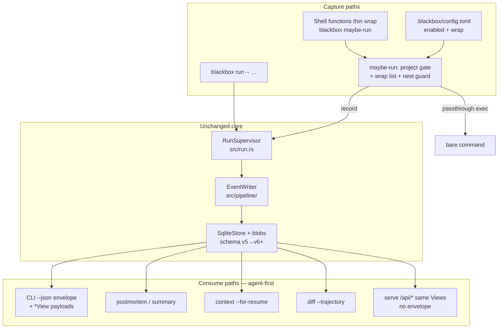

# blackbox as Daily-Driver Flight Recorder for AI-Agent Workflows

> **Historical design document.** Not a getting-started guide. Current docs: [../README.md](../README.md).

| Field | Value |
|---|---|
| **Document** | Product + Technical Design |
| **Author** | TBD |
| **Date** | 2026-07-12 |
| **Status** | Implemented — shipped as **0.3.0** (single product release; not a multi-version train) |
| **Baseline** | blackbox-recorder 0.1.0 → 0.3.0 (`/home/ubuntu/work/blackbox`) |
| **Shipped as** | **0.3.0** (floor + agent loop together). Historical `v0.2.0` was an intermediate tag only. |
| **Note** | Internal PR ordering in this doc is archival. Product versioning is one release at a time. |

---

## Overview

**blackbox** already ships a complete local flight-recorder stack: PTY supervision (`src/run.rs`), redact-before-write secrets (`src/redaction/`), SQLite + content-addressed blobs (`src/storage/sqlite.rs`, `SCHEMA_VERSION = 5`), Claude/Codex adapters (`src/adapters/`), analysis passes, portable export, dir/HTTP/S3 sync, and a local axum dashboard (`src/serve.rs`). An evaluator still would not leave it on forever — capture requires wrapping every command, postmortems are human-text only, harness coverage is narrow, debugger UX is shallow, export/capture redaction can destroy structural fields, and retention is manual.

This design expands blackbox from "optional tooling for important sessions" into **must-have local infrastructure**, in **staged releases** that do not overclaim "full daily-driver" until the full D1–D8 bar is met. It is grounded in existing extension points — not a rewrite — and includes go-to-market for humans and agent-to-agent adoption.

---

## Background & Motivation

### Current state (0.1.0)

```
CLI (clap) → RunSupervisor → CaptureLayers (Git, FS, Process) + PTY I/O
                    │              │
                    │         mpsc merge → EventWriter (seq + persist)
                    │              │
              PTY path ──→ normalize → redact → blob → adapter parse
                    │                         → EventWriter
                    │
              TraceStore (SQLite + .blackbox/blobs/ + FTS5)
                    │
         ┌──────────┼──────────────┬────────────┐
    AnalysisPass  Export/Import  Serve/SSE   UI / CLI
                  Sync (dir/HTTP/S3)
```

| Capability | Status | Gap for daily-driver |
|---|---|---|
| Capture | `blackbox run -- <cmd>` only (`Command::Run`) | Explicit wrap tax on every session |
| Inspect | Human text via `println!` in `cmd_*` | No global `--json` |
| Adapters | Claude, Codex, Generic fallback | Cursor/Aider/etc. → best-effort "PTY soup" |
| Analyze | Regex error detector + classifier + correlator | No productized postmortem command |
| Diff | Tool-set membership + kind counts (`cmd_diff`) | Not a trajectory alignment |
| Replay/fork | Sandbox seed, mock tools, `fork --launch` | Not "agent resume with context pack" |
| Redaction | Same `SecretScanner` at capture and export | Pattern `^[A-Za-z0-9+/]{40,}={0,2}$` matches pure hex/base64-ish strings (git SHAs, blob ref strings, IDs) — damages **at rest** and on export of structural scalars; portable top-level `blobs` **map keys** are already restored around `redact_json` in `export/mod.rs` |
| Ops | Manual `purge` / `scrub --gc` | No policy-driven retention |
| Schema | `SCHEMA_VERSION = 5` | No run-level metrics columns |

### Pain points (evaluator conclusions, validated against code)

1. **Capture tax** — only path is `Command::Run` + `RunSupervisor::execute`.
2. **Human-first inspect** — `cmd_show`, `cmd_timeline`, `cmd_inspect`, `cmd_analyze`, `cmd_diff` all text; serve exposes raw JSON without CLI envelope.
3. **Narrow harness coverage** — basename match on `claude` / `codex` in `src/run.rs`; else `GenericAdapter`.
4. **Weak debugger UX** — `ErrorDetector` is regex-based; `cmd_diff` is set difference of `tool_name`.
5. **Structural redaction false positives** — whole-string base64 pattern in `scanner.rs`; `ExportRedactor` has no field allowlist. Primary breakage: `git_commit`, event `*_blob` hex refs, run/event IDs when values are whole-string matches. Portable `blobs` object keys are **already protected** by clone/restore in `export/mod.rs`; blob **payload** content is still (correctly) scanned after restore.
6. **Manual ops** — `purge --keep N` exists but is opt-in; `get_events` loads all events with no limit.

### Why this matters now

Coding agents are the default development loop. When an agent fails after long token spend, operators need structured tools trail, git state, secrets-safe share, and a resume pack. Harness-native history is opaque; cloud observability is wrong for "my laptop + my keys." blackbox is the local secrets-first recorder already in the store — the gap is product friction.

---

## Goals & Non-Goals

### Goals

1. Frictionless, **project-scoped** capture (enable once per project; no silent global recording).
2. Agent-native CLI (`--json` with documented per-command schemas).
3. One-command postmortem (`summary` / `postmortem`).
4. Structure-preserving safe export (identifiers and CAS refs survive redaction).
5. Trajectory value (diff + resume context packs) — full bar by 0.3.
6. Self-managing store (policy retention) — full bar by 0.4; 0.2 ships config + config-driven purge bridge.
7. Market as infrastructure for humans and agents.

### Non-goals (locked; align with `docs/ROADMAP.md`)

- Multi-tenant hosted SaaS / remote multi-user ACLs
- Replacing harness-native session UI
- Perfect Windows PTY parity as a release blocker
- Guaranteeing every interactive TUI agent emits machine-readable tool events
- Kernel-level network sniffing as P0
- Breaking store open-compatibility without migration
- Calendar-driven SaaS monetization

### Orthogonal backlog (keep owners; not dropped when rewriting ROADMAP)

| Item | Owner note |
|---|---|
| Binary releases / install scripts | Ops; optional GitHub Actions assets; `cargo install` remains primary |
| Windows PTY/signal parity | Non-blocking; enable scripts may no-op with clear message |
| Serve multi-user ACLs | Out of scope indefinitely for now |

---

## Daily-driver product bar

### North-star criteria (D1–D8)

Leave blackbox on forever when **all** of the following hold:

| # | Criterion | Measurable target |
|---|---|---|
| D1 | **Capture tax ≤ 1 decision/project** | `blackbox enable` once in a project; configured basenames auto-record **only when cwd is under an enabled project**. |
| D2 | **Machine-readable inspect** | Listed commands support `--json` with documented `*View` schemas; agents parse without scraping. |
| D3 | **Postmortem in one command** | `blackbox postmortem latest` exits 0 with summary; performance strategy in P0-3 (not unbounded full-scan prose). |
| D4 | **Structure-safe share** | Portable/JSONL export never redacts `git_commit`, event/run IDs, sequences, or event `*_blob` keys; secrets in free-form content still redacted. |
| D5 | **Trajectory saves rework** | `diff --trajectory` + `context --for-resume` pack. |
| D6 | **Disk babysitting ≈ 0** | Retention policy apply path exists (`gc` / config-driven purge + blob GC); doctor reports size + policy. |
| D7 | **Secrets posture unchanged** | Default redact-before-write; no new secret-at-rest path without danger flags. |
| D8 | **Agent closes the loop** | Agent can record (ambient or `run`), list, postmortem, search, export redacted portable, and build a **resume pack** — all via JSON. |

### Release mapping (explicit — do not market 0.2 as full bar)

| Criterion | First release that claims it | Primary PRs |
|---|---|---|
| D1 | **0.2** | PR-04 (shared discovery), PR-04b, PR-05 |
| D2 (core: runs/show/timeline/inspect/analyze/search/stats/summary/doctor) | **0.2** | PR-02, PR-03, PR-06 |
| D2 (`diff` JSON) | **0.3** | PR-10 |
| D3 | **0.2** | PR-06 |
| D4 | **0.2** | PR-01 |
| D5 | **0.3** | PR-10, PR-12 |
| D6 (config + `purge --policy-from-config` bridge) | **0.2 partial** | PR-04, PR-05b |
| D6 full (`gc` product + auto opt-in) | **0.4** | PR-13 |
| D7 | **0.2** (regression gate) | PR-01 + security gate |
| D8 minus resume pack | **0.2** | PR-02–06 |
| D8 full (resume pack) | **0.3** | PR-12 |

### 0.2.0 exit criteria ("Daily-driver floor: capture + inspect + safe share")

Ship 0.2 only when:

1. **D1** — `maybe-run` + enable + project-scoped gate works as specified in P0-1.
2. **D2-core** — envelope + View schemas for: `runs`, `show`, `timeline`, `inspect`, `analyze`, `search`, `stats`, `summary`, `doctor` (feature-detect subset).
3. **D3** — `summary`/`postmortem` text + JSON with performance strategy (caps/filters).
4. **D4** — PR-01 security regression matrix green.
5. **D6-partial** — config `[retention]` + `blackbox purge --policy-from-config --yes` (or `gc --dry-run`/`--apply` thin wrapper).
6. **D7** — security regression gate green; ambient capture uses identical `CapturePolicy` defaults.
7. **D8-partial** — agent can list/show/postmortem/search/export via `--json` (no `context --for-resume` yet).

**Do not** claim full daily-driver / "leave on forever" in marketing until D5 + D6-full + D8-full land (0.3–0.4).

### Full daily-driver

All of D1–D8 at end of **0.3** (agent loop) + **0.4** (ops). Marketing line for 0.3: "agent feedback loop"; for 0.4: "ops-complete daily driver."

---

## Proposed Design

### North-star architecture (incremental on 0.1)



---

### P0 — Daily-driver floor (→ 0.2.0)

#### P0-1: Zero-friction capture (project-scoped)

**Problem:** Every session needs `blackbox run -- …`. Prior design mixed global shell functions with project config without a single gate — **not implementable safely**.

##### Locked model (single entrypoint)

**Preferred P0 runtime path: shell functions → `blackbox maybe-run`.**  
PATH shims under `.blackbox/bin/` are **optional P1**; not required for 0.2.

```fish
# Generated shell function — thin + missing-binary fallback
function claude
  if command -q blackbox
    command blackbox maybe-run -- claude $argv
  else
    command claude $argv
  end
end
```

```bash
# bash/zsh equivalent
claude() {
  if command -v blackbox >/dev/null 2>&1; then
    command blackbox maybe-run -- claude "$@"
  else
    command claude "$@"
  fi
}
```

If `blackbox` is missing from PATH, the harness command must still work (no hard failure). Optional one-shot stderr warn is out of scope for 0.2 (doctor surfaces binary-missing when blackbox is invoked).

`maybe-run` (new subcommand; `run --auto` alias acceptable) owns all **capture** policy:

| Check (in order) | Behavior |
|---|---|
| `BLACKBOX_OFF` set | `exec` bare command (no record; **does not open store**) |
| `BLACKBOX_ACTIVE_RUN` set | `exec` bare command (**nested agent launches are not separate runs** — intentional; see K13) |
| No enabled project config via **shared project discovery** | `exec` bare command (**does not open store**) |
| Basename of argv[0] ∉ `[capture].wrap` for that config | `exec` bare command (**does not open store**) |
| Else | Set `BLACKBOX_ACTIVE_RUN=<run_id>`; open the **discovered project store** (not cwd-local); set `RunArgs.project` / launch context to discovered root; delegate to `RunSupervisor` |

##### Shared project discovery + store path (locked — K21)

**Today (0.1 verified):** `open_store` in `src/cli.rs` always passes `std::env::current_dir()` into `BlackboxPaths::resolve`. That helper only checks **that directory** for legacy `./blackbox.db` or `./.blackbox/` — **no ancestor walk** (`src/config.rs`). Recording or inspecting from a monorepo subdirectory after `enable` at the root would create a **second** store under the child cwd and break D1/D8.

**0.2 rule — one discovery algorithm for config *and* store, used by every subcommand** (`maybe-run`, `run`, `show`, `postmortem`, `runs`, `purge`, `doctor`, …):

```
resolve_project_and_store(cwd, --store, BLACKBOX_DB):
  1. If --store or non-empty BLACKBOX_DB → BlackboxPaths::from_db_path (unchanged override).
  2. Starting at cwd, walk ancestors toward filesystem root:
     a. If <dir>/blackbox.db exists (legacy) → project root := <dir>; from_db_path(legacy). STOP.
        (Local legacy store wins over a parent config — preserves 0.1 migration.)
     b. If <dir>/.blackbox/config.toml exists:
        - Load config. Project root := <dir>.
        - Store := <dir>/.blackbox/blackbox.db (+ blobs/), regardless of enabled flag
          (read commands still see the project store; maybe-run uses enabled only for *recording*).
        STOP.
     c. If <dir>/.blackbox/blackbox.db exists without config.toml (pre-config 0.1 layout):
        Project root := <dir>; use that store. STOP.
  3. No ancestor hit → project root := cwd; default layout cwd/.blackbox/ (today's behavior).
```

| Scenario | Behavior |
|---|---|
| enable at `/repo`, work in `/repo/packages/api` | All CLI opens `/repo/.blackbox/blackbox.db` |
| maybe-run records from child cwd | Same store; `Run.project_dir` / launch `project` = `/repo`; process cwd can stay child for the harness |
| `postmortem latest` from any child | Sees runs written under the root store |
| Subdir has its own legacy `./blackbox.db` | That subdir store wins (isolated legacy project) |
| Subdir has `.blackbox/config.toml` | Nested project root; stops walk (inner project wins) |
| Global shell function outside any `.blackbox` | maybe-run passthrough; no store created |

**API shape (`src/config.rs`):**

```rust
pub struct ProjectDiscovery {
    pub project_root: PathBuf,
    pub paths: BlackboxPaths,
    pub config: Option<BlackboxConfig>, // None if no config.toml
}

/// Shared by open_store, maybe-run, enable, doctor.
pub fn discover_project(
    cwd: &Path,
    db_override: Option<&Path>,
) -> anyhow::Result<ProjectDiscovery>;
```

`open_store` becomes: `discover_project(cwd, cli.store.as_deref())` → open `paths` (call `ensure_dirs` only when the command will write — record/import/purge — not on pure passthrough).

**Tests (PR-04 acceptance):** enable at root → `maybe-run` from child records → `postmortem latest` from child finds run; `--store` override still wins; legacy subdir `blackbox.db` isolates.

##### Config shape

```toml
# .blackbox/config.toml
enabled = true

[capture]
# Default wrap list (K14): only first-party supported harnesses
wrap = ["claude", "codex"]
default_tags = ["auto"]

[retention]
keep_runs = 50
max_age_days = 30
auto_gc_blobs = true
# auto post-run purge: off until 0.4
auto_apply = false

[redaction]
# custom_patterns = []  # additive only; never disables defaults
```

##### `blackbox enable` / `disable`

- **`enable`:** creates/updates `.blackbox/config.toml` with `enabled = true`, default wrap list; prints shell snippet install instructions (does **not** auto-edit user rc without `--install-shell` explicit opt-in). Snippets always include **missing-binary fallback**.
- **`disable`:** sets `enabled = false` in project config (shell functions may remain; maybe-run no-ops).
- **Recording is opt-in per project** (`enabled`); **shell install is separate opt-in** (user pastes snippet or `--install-shell`).

##### Nested capture policy (locked)

Under an active blackbox-supervised run, nested `claude`/`codex` invocations are **not** new runs. Rationale: double-PTY and recursive wrap are worse than missing child run records; parent PTY still captures nested terminal output. Document clearly; future opt-in `capture.nested = true` is non-goal for 0.2.

##### Files

- `src/config.rs` — `BlackboxConfig`, `discover_project` / ancestor walk (config **and** store)
- `src/cli.rs` — `open_store` via discovery; `MaybeRun`, `Enable`, `Disable`
- `src/run.rs` — set/clear `BLACKBOX_ACTIVE_RUN`; `project` = discovered root; unchanged `CapturePolicy` defaults

---

#### P0-2: Machine-readable inspect (`--json`)

##### Global flag + envelope

```rust
// src/cli.rs
pub struct Cli {
    pub store: Option<PathBuf>,
    #[arg(long, global = true)]
    pub json: bool,
    pub command: Command,
}
```

Envelope (CLI only):

```json
{
  "ok": true,
  "schema": "blackbox.cli/v1",
  "command": "show",
  "data": { }
}
```

Error:

```json
{
  "ok": false,
  "schema": "blackbox.cli/v1",
  "command": "show",
  "error": { "code": "not_found", "message": "…" }
}
```

##### Error codes (closed set for v1)

| Code | Meaning |
|---|---|
| `not_found` | Run/event missing |
| `ambiguous` | ID prefix matched multiple |
| `invalid_args` | Bad flags/args |
| `store_error` | SQLite/IO failure |
| `schema_too_new` | DB newer than binary |
| `unsupported` | Command lacks JSON yet (should not ship in P0 matrix) |
| `internal` | Unexpected |

##### Implementation pattern (fits `anyhow::Result` handlers)

Do **not** use `emit_err(...) -> !` inside `cmd_*`. Prefer:

```rust
// src/output.rs
pub fn emit_result<T: Serialize>(
    mode: OutputMode,
    command: &str,
    result: Result<T, CliError>,
) -> anyhow::Result<()> { /* print JSON or map text; set exit via main */ }

// Or: cmd_* returns Result<T> view; Cli::execute maps to text/JSON + exit code.
```

Top-level `Cli::execute` / `main` maps `CliError` → exit code (1 for user errors, 2 for store/internal).

##### CLI vs serve

| Surface | Shape |
|---|---|
| CLI `--json` | Envelope + `data: *View` |
| HTTP `GET /api/...` | **Raw `*View` JSON only** (no envelope) — same serde types as `data` |

Shared module: `src/views.rs` (keep `cli.rs` from growing further — already ~2.2k LOC).

##### Normative P0 `data` payloads

**`runs` → `RunsView`**

```json
{
  "runs": [
    {
      "id": "uuid",
      "short_id": "8hex",
      "name": null,
      "status": "Succeeded",
      "exit_code": 0,
      "command": ["claude", "-p", "…"],
      "cwd": "/path",
      "started_at": "RFC3339",
      "ended_at": "RFC3339",
      "tags": ["auto"],
      "event_count": null
    }
  ]
}
```

(`event_count` optional/expensive — omit or fill only with `--counts`.)

**`show` → `ShowView`**

```json
{
  "run": { /* Run fields */ },
  "event_count": 120,
  "checkpoint_count": 2,
  "tool_calls": [{ "sequence": 3, "tool_name": "Bash" }],
  "error_event_count": 1,
  "structured_error_count": 2,
  "filesystem_event_count": 4,
  "resume": { "available": true, "command": ["claude", "--resume", "…"] },
  "hints": ["blackbox timeline …", "blackbox postmortem …"]
}
```

**`timeline` → `TimelineView`**

```json
{
  "run_id": "…",
  "semantic": true,
  "events": [
    {
      "id": "…",
      "sequence": 0,
      "source": "Tool",
      "kind": "tool.call",
      "status": "Success",
      "side_effect": "Read",
      "started_at": "…",
      "duration_ms": 12,
      "detail": "Bash",
      "metadata_preview": {}
    }
  ],
  "truncated": false,
  "total_matched": 80
}
```

**`inspect` → `InspectView`**

```json
{
  "run_id": "…",
  "event": { /* full TraceEvent */ },
  "blob_text": null
}
```

**`analyze` → `AnalyzeView`**

```json
{
  "run_id": "…",
  "derived_count": 10,
  "structured_errors": [{ "error_type": "rustc[E0425]", "message": "…", "file": "…", "line": 1 }],
  "by_kind": { "analysis.side_effect": 4 },
  "samples": [ /* small TraceEvent-like objects */ ],
  "persisted": false
}
```

**`search` → `SearchView`**

```json
{
  "query": "…",
  "hits": [{ "run_id": "…", "event_id": "…", "score": 1.0, "snippet": "…" }],
  "truncated": false
}
```

**`stats` → `StatsView`** — aggregate counts already printed by `cmd_stats`, as structured fields.

**`summary` / `postmortem` → `SummaryView`** — see P0-3.

**`doctor` JSON subset (agent feature-detect)** → `DoctorView`:

```json
{
  "version": "0.2.0",
  "schema_version": 5,
  "db_path": "…",
  "blob_dir": "…",
  "db_exists": true,
  "store_size_bytes": 1234567,
  "run_count": 12,
  "config": {
    "present": true,
    "enabled": true,
    "wrap": ["claude", "codex"],
    "retention": { "keep_runs": 50, "max_age_days": 30 }
  },
  "shell_integration_hint": "functions call maybe-run; binary on PATH: true"
}
```

##### P0 coverage matrix

| Command | JSON in 0.2 |
|---|---|
| runs, show, timeline, inspect, analyze, search, stats | yes |
| summary/postmortem | yes |
| doctor | yes (DoctorView) |
| export/import/sync/run/rm/purge | text primary; export stays stream formats (not envelope) |
| diff | **0.3** |
| context | **0.3** |

Stdout/stderr: with `--json`, only envelope on stdout; diagnostics on stderr.

---

#### P0-3: `blackbox summary` / `postmortem`

```bash
blackbox postmortem latest
blackbox summary latest --json
blackbox summary <run> --short
```

**Composition sources (no new capture):** Run header; tool call stats; `ErrorDetector::extract_errors`; high-signal side effects; checkpoint git tips; `resume::resume_command`; fixed next-step hints.

**`SummaryView` (normative):**

```json
{
  "run_id": "…",
  "status": "Failed",
  "exit_code": 1,
  "duration_ms": 120000,
  "command": ["…"],
  "tags": [],
  "tools": { "total": 20, "failed": 2, "names": ["Read", "Bash"] },
  "errors": [{ "error_type": "…", "message": "…", "sequence": 9 }],
  "side_effects": [{ "kind": "analysis.side_effect", "effect": "local-write", "detail": "…" }],
  "git": { "start": "abc…", "end": "def…" },
  "resume": { "available": false, "command": null },
  "truncated": false,
  "events_scanned": 5000,
  "hints": ["blackbox analyze …", "blackbox fork … --launch"]
}
```

##### Performance strategy (grounded in store APIs)

Today `SqliteStore::get_events` loads **all** events (`SELECT … ORDER BY sequence` — no limit). Unbounded multi-hour runs + full analysis is not a reliable 2s guarantee. **In-memory-only truncate after loading all rows is not acceptable** for PR-06 merge — it still does O(all events) I/O and deserialization.

**Mandatory for PR-06 merge:**

1. **SQL-bounded fetch** via a new store API, e.g.:
   ```rust
   async fn get_events_limited(
       &self,
       run_id: &str,
       limit: usize,
       // optional: order newest-first for tail, or sequence ASC with LIMIT
   ) -> Result<Vec<TraceEvent>>;
   ```
   Implemented as `… ORDER BY sequence DESC LIMIT ?` (then reverse) or equivalent so the database does not materialize the full event list. Default **N = 10_000**.
2. If `COUNT(*)` (or a cheap existence check for sequence ≥ N) shows more rows than returned, set `truncated: true` and `events_scanned` to the returned count.
3. **Optional polish (same PR or 0.2 follow-up):** kind/status SQL filter (`tool.call`, `tool.result`, `process.error_banner`, error status, `harness.%`) to raise signal density within the LIMIT — not a substitute for LIMIT.
4. `--short`: use smaller limit (e.g. 500) + run row + structured errors only — **no** full SideEffectClassifier/Correlator.
5. Default `postmortem` = short+errors path; `--full` may raise limit / enable full analyze composition (still SQL-limited; never unbounded `get_events`).
6. **Acceptance:** fixture with >>10k synthetic events; assert summary path does not call unbounded `get_events`; `--short` under CI time budget (~2s).

**D3 wording:** postmortem **usable in one command**; latency SLA applies to SQL-capped default/`--short` path.

**Files:** `src/summary.rs`, **mandatory** `get_events_limited` (or equivalent) on `TraceStore` / `SqliteStore` in PR-06.

---

#### P0-4: Fix structural redaction false positives

##### Accurate diagnosis

| Surface | Behavior today |
|---|---|
| `SecretScanner` whole-string `^[A-Za-z0-9+/]{40,}={0,2}$` | Matches 40-hex git SHAs, 64-hex blob keys **as pure string values** at **capture** and **export** |
| `ExportRedactor::redact_json` | Walks every string; no field allowlist |
| Portable `blobs` map | **Already protected**: map cloned, rest redacted, map restored (`export/mod.rs`); payload bytes re-scanned |
| Format-specific path minimization | jsonl/html already basename-redact `cwd` **before** ExportRedactor — allowlist must not re-expand secrets into paths, but basename cwd is not a secret pattern issue |

**Primary fix targets:** `git_commit`, event `input_blob`/`output_blob`/`error_blob`/checkpoint blob refs, run/event `id` fields when scanned as pure strings, any structural hex scalar. Not "portable blob map keys" as the main story.

##### A. Scanner change (capture + export)

- **Remove** the whole-string base64/`SshKey` pattern for P0.
- Keep PEM `BEGIN … PRIVATE KEY` pattern (real SSH material).
- **Do not** ship a high-entropy base64 replacement in P0 (undefined entropy heuristics are a footgun). Revisit in P1 only with a written heuristic + fixtures.
- Capture-time fix stops **new** at-rest corruption.

##### B. Structural allowlist (export — mandatory)

Semantics (**path-aware**, not bare last-segment):

- Track JSON path while recursing (e.g. `events[3].metadata.status`).
- **Skip scanner only** when the key is on the structural set **and** the parent context is structural:
  - Top-level portable/run/event/checkpoint object fields
  - Known structural containers: run object, event object (outside `metadata`), checkpoint object, blob **map keys** (already restored) / blob entry `key`/`size`/`content_type` (not `data`)
- **Never skip** when any ancestor path segment is free-form: `metadata`, `input`, `output` (tool payload), `command` (array values always scanned), `preview`, `message`, `notes`, `raw`, `diff_preview`, blob `data`, environment values.
- **Deny-by-default** for unknown keys and unknown nesting: still run scanner.
- **Structural key set** (only meaningful in structural parent context):  
  `id`, `run_id`, `parent_run_id`, `parent_event_id`, `event_id`, `sequence`, `next_sequence`, `git_commit`, `git_diff_blob`, `input_blob`, `output_blob`, `error_blob`, `environment_blob`, `filesystem_manifest_blob`, `transcript_blob`, `key`, `schema_version`, `content_type`, `started_at`, `ended_at`, `status`, `kind`, `source`, `side_effect`, `harness_session_id`, `cwd`, `project_dir`  
  - Path minimization for `cwd` stays format-specific (jsonl/html basename); allowlist only prevents re-scanning identifiers after that rewrite.
- **Unit test (mandatory):** `{"metadata":{"status":"sk-abcdefghijklmnopqrstuvwxyz012345"}}` still redacts the secret (must **not** treat nested `status` as structural).

##### C. Historical data

Stores already written may contain `[REDACTED]` where a git SHA or blob ref once was — **unrecoverable** if the only copy was redacted.

- Document: after upgrading scanner, run `blackbox scrub` does **not** restore false-positive damage (scrub only re-redacts secrets).
- Doctor warning copy: "structural IDs may have been damaged by pre-0.2 scanners; re-record critical runs if git_commit shows [REDACTED]."
- No automatic rewrite migration (cannot invent lost SHAs).

##### D. PR-01 security regression matrix (mandatory)

Every `BASE_PATTERNS` class must keep a golden fixture that still redacts:

| Class | Example fixture |
|---|---|
| AuthorizationHeader | `Bearer eyJ…` / `Basic …` |
| ApiKey generic | `api_key=…` |
| password/secret/token assignment | `password=hunter2plus` |
| GitHub ghp/gho/ghu/ghs/ghr | `ghp_…` |
| OpenAI `sk-` | `sk-…` |
| Anthropic `sk-ant-` | `sk-ant-…` |
| AWS AKIA/ASIA | `AKIA…` |
| Slack xox* | `xoxb-…` |
| JWT three-part | `eyJ….eyJ….sig` |
| PEM private key | `-----BEGIN … PRIVATE KEY-----` |
| Connection string | `postgres://u:p@host/db` |
| Google API `AIza…` | |
| Stripe sk_live/pk_live/… | |
| npm `npm_…` | |

**Must NOT redact:** pure `^[0-9a-f]{40}$`, `^[0-9a-f]{64}$`, UUID run ids, normal prose.

**Allowlist unit tests:** values under `preview`/`message`/`command` containing `sk-…` still become `[REDACTED]`; nested `metadata.status` with `sk-…` still redacts (path-aware allowlist).

##### E. Security regression gate for 0.2 (Issue 13)

Before 0.2 tag:

1. Capture path: argv/terminal with sk-/ghp_/PEM still redacted at rest.
2. Export path: full matrix above + structure preserved.
3. Ambient `maybe-run` uses same `CapturePolicy { redact: true, insecure_raw: false }`.
4. `--json` documents: output is as sensitive as store contents; not a new secret class; `--no-redact` export remains the only intentional secret-export path.
5. Shell history: wrappers should prefer not echoing secrets beyond what user typed (no extra logging of full argv in blackbox before redaction). Existing `RunSupervisor` redacts before persist — keep that single path.

---

### P1 — Agent feedback loop (→ 0.3.0)

#### P1-5: Trajectory diff

```bash
blackbox diff A B
blackbox diff A B --trajectory
blackbox diff A B --json
```

**Algorithm choice (see Alternatives):** P1 ships **greedy longest common prefix** on semantic keys `(kind, tool_name|kind, status)`, then first divergence index + ordered only-in-A/B tails. Full LCS optional follow-up if noisy. Ignore harness-internal tool_use ids in the key.

#### P1-6: Token / cost / duration — schema v6 (fully specified)

##### SQL migration sketch (follow existing transactional pattern in `sqlite.rs`)

```sql
-- migrate_v6 inside unchecked_transaction; then INSERT schema_version 6
ALTER TABLE runs ADD COLUMN duration_ms INTEGER;
ALTER TABLE runs ADD COLUMN adapter TEXT;
ALTER TABLE runs ADD COLUMN session_id TEXT;
ALTER TABLE runs ADD COLUMN input_tokens INTEGER;
ALTER TABLE runs ADD COLUMN output_tokens INTEGER;
ALTER TABLE runs ADD COLUMN total_tokens INTEGER;
ALTER TABLE runs ADD COLUMN estimated_cost_usd REAL;
ALTER TABLE runs ADD COLUMN model TEXT;
```

`SCHEMA_VERSION = 6`. Backfill: `duration_ms` from `ended_at - started_at` where both non-null; tokens/cost/model stay NULL; optionally parse `notes` for `adapter:` / `session:` into columns (best-effort).

##### `Run` struct

```rust
// All new fields: Option<_>, #[serde(default)] for portable import of v5 archives
pub duration_ms: Option<u64>,
pub adapter: Option<String>,
pub session_id: Option<String>,
pub input_tokens: Option<u64>,
pub output_tokens: Option<u64>,
pub total_tokens: Option<u64>,
pub estimated_cost_usd: Option<f64>, // always None unless config price table present (K15)
pub model: Option<String>,
```

##### Code touchpoints (complete list)

| Area | Files / symbols |
|---|---|
| Struct + tests | `src/core/run.rs` |
| INSERT/UPDATE/SELECT + `run_from_row` | `src/storage/sqlite.rs` (explicit column lists today — **must** extend all three + mapper) |
| In-memory store | `src/storage/store.rs` |
| Finish path rollup | `src/run.rs` `RunSupervisor` end-of-run |
| Resume helpers | may read `run.session_id` preferring column over notes |
| Portable export/import | `src/export/portable.rs` — v5 JSON imports with defaults |
| Serve | `api_run` serializes `Run` |
| CLI views | `ShowView`, `RunsView`, `StatsView`, `SummaryView` |
| Integration tests | `tests/integration_run.rs` + unit Run constructors |

##### Rollup timing

- Adapters emit `kind = "harness.usage"` events when NDJSON includes usage (new parse paths in `parse.rs`).
- **On run finish only:** scan events (or maintain counters during capture) — **last non-empty usage event wins** for token fields; sum optional later.
- Late usage lines after process exit: best-effort drain of PTY buffer already exists; no separate wait beyond current grace. If missing, leave NULL.
- `estimated_cost_usd`: **remain NULL** unless `[pricing]` config exists (K15). Never invent prices.

##### Compatibility

- Old binary + v6 DB: hard-error `schema_version > SCHEMA_VERSION` (existing behavior) — **downgrade requires DB restore from backup**, not binary-only rollback.
- New binary + v5 DB: migrates forward.
- Portable v2 import: missing fields → NULL via `#[serde(default)]`.

#### P1-7: Broader adapters + generic NDJSON protocol

Canonical **blackbox stream protocol v1** lines (document in `docs/agent-api.md`):

```json
{"type":"tool_call","id":"…","name":"Bash","input":{}}
{"type":"tool_result","id":"…","output":"…","is_error":false}
{"type":"session","session_id":"…"}
{"type":"usage","input_tokens":123,"output_tokens":45,"model":"…"}
{"type":"message","role":"assistant","text":"…"}
```

**Ordering note:** PR-11 may parse `type:usage` into events **before** PR-09 run rollup exists — that is fine: events are queryable; run columns fill once PR-09 lands. Cross-link in PR descriptions.

#### P1-8: `context --for-resume`

```bash
blackbox context latest --for-resume --json --max-tokens 4000
```

Bounded redacted pack: outcome, git tip, failed tools/errors, last K tool names, FS write summary, resume command, optional transcript tail. Complements `fork --launch`; does not replace harness session resume.

---

### P2 — Ops, fidelity, polish (→ 0.4.0)

#### P2-9: Network

Opt-in protocol lines / future proxy; no eBPF. `EventSource::Network` already exists.

#### P2-10: Automatic retention

- 0.2: config + policy helper (D6-partial) — algorithm specified under PR-05b (not a pure flag-reuse of today's `purge`).
- 0.4: `blackbox gc` dry-run default / `--apply`; optional post-run when `auto_apply = true`; pin via tag **`pinned`** (K16) — never delete tagged runs.
- Doctor: size, policy, last apply.

#### P2-11: Sandbox / workspace restore

**Spike first** (1 eng-week). Current `SandboxReplay` seeds shallow cwd copy with caps (`SEED_MAX_FILES` 5k, 64 MiB). P2 goal: clearer allow/deny + optional **git checkout of checkpoint commit** in sandbox — **not** full FS snapshot restore guarantee. Do not promise bit-identical workspace.

#### P2-12: Dashboard + optional MCP

After CLI agent-usable: summary/context routes; usage columns. MCP thin wrapper over Views — 0.4 if demand (K17).

---

## API / Interface Changes

| Interface | Change | Release |
|---|---|---|
| `blackbox --json` | Envelope + Views | 0.2 |
| `blackbox maybe-run` | Project-gated auto capture | 0.2 |
| `blackbox enable` / `disable` | Config + shell instructions | 0.2 |
| `blackbox summary` / `postmortem` | One-shot diagnosis | 0.2 |
| `purge --policy-from-config` | D6-partial | 0.2 |
| `blackbox context --for-resume` | Resume pack | 0.3 |
| `blackbox diff --trajectory` | Trajectory | 0.3 |
| `blackbox gc` | Full retention product | 0.4 |
| Serve summary/context routes | Same Views | 0.3–0.4 |

---

## Data Model Changes

### Migration strategy

| Version | Change |
|---|---|
| v5 | Baseline 0.1.0 |
| **v6** | Additive run metrics columns (ALTER TABLE × N) |
| **v7** (optional) | Only if pin cannot be tag-based |

Rules: transactional migrations; hard-error if DB newer than binary; portable import defaults; no blob rewrites for metrics.

### Config layout

```
.blackbox/
  blackbox.db
  blobs/
  config.toml      # NEW — enabled, capture.wrap, retention
```

---

## Alternatives Considered

### 1. Capture: shell wrappers vs daemon vs LD_PRELOAD

| Approach | Pros | Cons |
|---|---|---|
| **maybe-run + thin shell functions (chosen)** | Project gate, reviewable, reuses RunSupervisor | Only configured basenames; non-shell launches miss |
| Daemon + exec interceptor | Always-on | Complex, trust, opt-out hard |
| LD_PRELOAD / ptrace | Catches everything | Fragile; wrong for secrets-adjacent tool |

### 2. Machine API: global `--json` vs `api` subcommand vs serve-only

| Approach | Pros | Cons |
|---|---|---|
| **Global `--json` (chosen)** | One binary; offline agents | Dual render cost |
| `blackbox api …` | Separation | Discovery tax |
| HTTP only | Exists partially | Server required |

### 3. Export safety: allowlist + scanner vs pattern-only vs free-text-only

| Approach | Pros | Cons |
|---|---|---|
| **Both allowlist + remove whole-string base64 (chosen)** | Defense in depth | Allowlist maintenance |
| Pattern-only | Smaller diff | Future patterns re-break structure |
| Free-text-only redaction rewrite | Purity | Large export rewrite |

### 4. Postmortem: compose vs always persist analysis

| Approach | Pros | Cons |
|---|---|---|
| **Compose on read (chosen)** | No store noise | Slight analyze duplication |
| Always persist | Queryable | Seq noise, clutter |

### 5. Trajectory algorithm

| Approach | Pros | Cons |
|---|---|---|
| **Greedy LCP on semantic keys (chosen for P1)** | Simple, explainable first divergence | Misses insertions mid-run |
| Full LCS/Myers | Better alignment | More code; harder to explain |
| Event-id alignment | Perfect if same ids | Useless across runs |
| External `diff` tools | Familiar | Not structured/JSON |

### 6. Metrics storage

| Approach | Pros | Cons |
|---|---|---|
| **Run columns + harness.usage events (chosen)** | Fast `runs`/`stats` queries; detail preserved | Migration surface |
| Events only | No schema change | Slow aggregates; weak list UX |
| Notes bag | Zero migration | Unqueryable soup |

### 7. Retention UX

| Approach | Pros | Cons |
|---|---|---|
| **Config + purge bridge in 0.2; `gc` product in 0.4 (chosen)** | Reuses `purge`/`gc_unreferenced_blobs` | Two names briefly |
| Only document manual purge | Minimal code | Fails D6 |
| SQLite TTL triggers | Automatic | Surprising deletes; hard pin |

### 8. Context pack vs harness resume only

| Approach | Pros | Cons |
|---|---|---|
| **blackbox-native pack + optional harness resume cmd (chosen)** | Works cross-harness; redacted/bounded | Not full chat history |
| Only `claude --resume` | Native fidelity | Session may be gone; not portable |

---

## Security & Privacy Considerations

### Invariants

1. Redact-before-write default (`CapturePolicy`).
2. Export/sync redacted by default.
3. No secrets in FTS (existing scanner).
4. Serve localhost default + optional token.
5. Allowlist never covers free-form secret carriers.

### Ambient capture blast radius

Daily-driver multiplies volume of redacted data at rest. **Mitigation:** same redaction path; PR-01 matrix; no new side channels; document store sensitivity for `--json`.

### 0.2 security regression gate (mandatory checklist)

- [ ] Capture: sk-, ghp_, PEM, AKIA, JWT, bearer still redacted at rest  
- [ ] Export: structure (`git_commit`, blob refs, ids) preserved  
- [ ] Export: free-form `preview`/`message`/`command` still redacts secrets  
- [ ] maybe-run uses default `CapturePolicy`  
- [ ] No whole-string base64 pattern  
- [ ] Integration test: portable export round-trip with git checkpoint  

---

## Observability

| Signal | Where |
|---|---|
| maybe-run decision (record vs passthrough) | `tracing` at debug/info |
| Adapter / finish rollup | existing + usage |
| Summary truncated / events_scanned | SummaryView fields |
| Store size / run count / config | `doctor` text+JSON |
| Retention apply | gc/purge logs |
| Redaction false-positive reports | GitHub issue template; no prod telemetry |

### Doctor extensions (0.2)

Config present/enabled/wrap; **discovered `project_root` + db path** (so monorepo users see which store is active); retention; schema version; store size estimate (`db + blobs` walk); binary version; hint if shell functions reference blackbox but binary missing (`command -v`).
### Disk expectations under ambient capture

Rough guide (order-of-magnitude): a 30-minute agent run might be **10–200 MB** depending on terminal verbosity and blob retention. With `keep_runs = 50`, plan for **low single-digit GB** per active project worst case before policy apply. Doctor should surface size so users apply purge before pain.

### Post-PR-01 runbook: "export still redacts structure"

1. Confirm binary ≥ 0.2 (`blackbox --version`).
2. `blackbox doctor --json` → schema + version.
3. Reproduce with fixture: event with `git_commit` / blob ref; export portable; assert fields.
4. If only historical runs show `[REDACTED]` in git_commit, data was damaged at capture pre-fix — re-record; scrub cannot restore.

---

## Rollout Plan

| Release | Theme | Exit | Est. eng effort |
|---|---|---|---|
| **0.2.0** | Capture + inspect + safe share floor | 0.2 exit criteria above | **~3–5 eng-weeks** (PR-01…07 + 05b) |
| **0.3.0** | Agent loop | D2-diff, D5, D8-full, v6 metrics | **~3–4 eng-weeks** |
| **0.4.0** | Ops + polish | D6-full, sandbox spike outcomes, dashboard/MCP | **~3–5 eng-weeks** |

### Compatibility

- Additive CLI; additive migrations.
- JSON `blackbox.cli/v1`; bump only on breaking renames.
- Downgrade binary after v6 migrate: **restore DB backup**.

### Feature flags

- `BLACKBOX_OFF`, `BLACKBOX_ACTIVE_RUN`, config `enabled`.
- No compile-time features required for P0.

### Rollback

- `blackbox disable` / `BLACKBOX_OFF=1`.
- Uninstall shell functions.
- Redaction fix is forward-safe; historical damage not auto-healed.

---

## Marketing & Go-to-Market

### Positioning

| | |
|---|---|
| **Category** | Local AI-agent flight recorder |
| **One-liner** | **blackbox records every agent run on your machine — secrets redacted, timeline honest, shareable without the panic.** |
| **0.2 message** | "Capture + inspect + safe share floor" — enable per project, postmortem, JSON, fixed export |
| **0.3 message** | "Agents can debug agents" — trajectory, context packs, usage |
| **0.4 message** | "Leave it on" — retention + ops complete |

### Personas

Solo engineer; agent team; platform/DevEx; **the agent itself**.

### Messaging pillars

Secrets never at rest by default; honest timeline; agent-native API; share safely (structure preserved).

### "Disaster if missing"

Lost agent context = lost money/time + secrets risk in paste-ups.

### Launch sequence by release

| When | Actions |
|---|---|
| **0.2 tag** | README hero: enable → agent → postmortem → redacted HTML; crates.io description refresh; demo script in README; skill file outline; HN post draft; CHANGELOG 0.2 |
| **0.3** | Document context/diff/usage; agent skill update |
| **0.4** | "Leave on forever" blog; optional MCP listing |

### 0.2 GTM checklist (one-page)

1. **README hero workflow** — project enable, shell snippet, `postmortem --json`, `export --format html`.
2. **Demo script** (checklist for launch video/gist):
   - `blackbox enable`
   - Install fish/bash function
   - Run a deliberately failing `claude -p "…"` (or fixture `blackbox run -- false` + seeded store)
   - `blackbox postmortem latest`
   - `blackbox export latest --format html > /tmp/bb.html`
   - Show structure fields intact in portable export.
3. **Skill artifact** — path e.g. `skills/blackbox.md` or `.claude/skills/blackbox.md`:
   - When to use: after agent failure; before expensive retry; when sharing traces.
   - Commands: `doctor --json`, `runs --json`, `postmortem latest --json`, `search --json`, `export … portable`.
   - When **not** to call: interactive pure chat with no tools; user set `BLACKBOX_OFF`.
   - Failure handling: if `ok: false` / `not_found`, fall back to user-visible message; never invent run ids.
4. **crates.io** — keywords remain ai/agent/debugger/trace; description mentions flight recorder + secrets-first.
5. **Launch post outline** — problem (lost agent runs) → demo → secrets policy → "not LangSmith" → install.
6. **North-star metrics (lightweight):**
   - `cargo install` / GitHub clone or star delta post-launch
   - Time-to-first-postmortem in docs feedback
   - Qualitative: "skill invoked" reports from early users

### Share artifact quality bar

Redacted HTML export must: render run header + timeline without secrets; show tool names; not display raw env; pass "no sk-/ghp_ in file" smoke test in CI on a fixture with planted secrets.

### Competitive framing / viral loop / OSS

Unchanged intent: local vs SaaS vs harness UI vs `script`; redacted HTML/portable as share primitive; MIT OR Apache-2.0 OSS-first.

### Agent-facing distribution

1. CLI `--json` + View schemas (0.2)  
2. Skill files (0.2)  
3. NDJSON protocol (0.3)  
4. MCP optional (0.4)

---

## Key Decisions

| # | Decision | Rationale |
|---|---|---|
| K1 | **maybe-run + thin shell functions; PATH shims optional later** | Project-scoped gate; single policy engine; safe outside projects |
| K2 | **Global `--json` envelope; serve returns raw Views** | Agents offline; HTTP stays clean; shared `src/views.rs` |
| K3 | **`summary`/`postmortem` compose on read** | Fast UX; no store pollution |
| K4 | **Export safety = allowlist + remove whole-string base64; no entropy heuristic in P0** | Fixes structure without fake science |
| K5 | **Usage/metrics as additive v6 columns + usage events** | Queryable stats; detail retained |
| K6 | **Trajectory = greedy LCP first** | Explainable; shippable |
| K7 | **Resume via context pack + fork --launch** | Cross-harness memory |
| K8 | **Generic NDJSON protocol first-class** | Multiplies coverage |
| K9 | **Retention: config+purge bridge in 0.2; full gc product 0.4; auto off by default** | Avoid silent deletes |
| K10 | **OSS local; MCP after CLI** | Truth in marketing |
| K11 | **Dashboard after CLI agent-usable** | Foundation first |
| K12 | **Preserve 0.1 quality-bar invariants** | Trust is the product |
| K13 | **Nested harness under ACTIVE_RUN = passthrough (not new run)** | Avoid double-PTY; parent captures TTY |
| K14 | **Default wrap = `claude` + `codex` only** | Supported adapters only; config extends |
| K15 | **`estimated_cost_usd` always NULL without explicit pricing config** | No wrong money |
| K16 | **Pin for retention via tag `pinned`** | No schema required for P2 |
| K17 | **MCP targets 0.4, not 0.2/0.3** | CLI/skills first |
| K18 | **0.2 is "floor" not full daily-driver** | Honest exit criteria |
| K19 | **Enable = project recording opt-in; shell install separate** | No surprise global capture |
| K20 | **Binary releases + Windows stay orthogonal backlog** | Not dropped when ROADMAP rewritten |
| K21 | **Shared ancestor discovery for config + store on all CLI commands** | Monorepo subdir record/inspect hit the same project store; verified gap vs 0.1 cwd-only `open_store` |
| K22 | **Retention policy = unpinned AND (outside keep window OR older than max_age); dry-run default** | Predictable OR delete set; no silent apply |
| K23 | **Summary requires SQL LIMIT; path-aware export allowlist** | Bounded I/O; no free-form nested structural-name skip |

---

## Risks

| Risk | Severity | Mitigation |
|---|---|---|
| Shell integration double-PTY | High | maybe-run nest guard; tests |
| Global functions without project gate | High | **Fixed by maybe-run design** |
| Subdir creates second store | High | **K21 shared `discover_project` for all CLI** |
| `--json` half-migrated | Medium | P0 matrix mandatory |
| Allowlist misses secret field | High | Deny-by-default + tests |
| Remove base64 misses rare secrets | Medium | Full BASE_PATTERNS matrix; PEM kept |
| Summary perf on huge runs | Medium | Filter SQL, caps, `--short` |
| Auto-retention deletes evidence | Medium | Dry-run; `pinned` tag; auto off |
| Schema downgrade confusion | Medium | Document restore; hard-error |
| Sandbox restore overpromise | Medium | Spike-first; git checkout only |
| Ambient disk growth | Medium | Doctor size; retention bridge 0.2 |
| Scope creep SaaS | Low | Non-goals |

---

## Open Questions

Resolved into Key Decisions where possible (K13–K20). Product decisions locked 2026-07-12:

1. **`postmortem` vs `show` for failed runs** — **separate forever**. Keep `show` and `postmortem` distinct; may add a soft tip in `show` for failed runs (`hint: blackbox postmortem <id>`) but never auto-replace the show summary.
2. **Cursor/Aider in default wrap?** — no until adapters exist; users may add to config at own risk (generic parse).
3. **Exact CI time budget for summary bench** — set when CI hardware known; target 2s for `--short` @ 10k events.

Implementation start: **PR-01** (structural redaction false positives) first, in parallel with plan landing under `docs/plan/`.

---

## References

| Path | Relevance |
|---|---|
| `AGENTS.md` | Architecture |
| `docs/ROADMAP.md` | Quality bar, non-goals |
| `docs/AUDIT.md` | Security baseline |
| `README.md` | User workflows |
| `src/cli.rs` | Subcommands (~2.2k LOC — push views out) |
| `src/run.rs` | RunSupervisor |
| `src/config.rs` | BlackboxPaths, CapturePolicy |
| `src/core/*` | Data model |
| `src/redaction/scanner.rs` | BASE_PATTERNS + over-broad base64 |
| `src/redaction/export.rs` | No allowlist today |
| `src/export/mod.rs` | Portable blobs map restore |
| `src/export/jsonl.rs` / `html.rs` | cwd basename minimization |
| `src/adapters/*` | Harness extension |
| `src/analysis/*` | Passes for summary |
| `src/resume.rs` | Session/resume |
| `src/serve.rs` | Raw JSON APIs |
| `src/storage/sqlite.rs` | Schema v5, explicit SQL columns, get_events unbounded |
| `src/scrub.rs` | GC helpers |
| `src/replay/sandbox.rs` | Seed caps; restore spike baseline |

---

## PR Plan

Independently reviewable PRs. **0.2 release cut = after PR-07** (includes PR-01–06 + 04b + 05b). Rough effort in person-days.

### PR-01: Fix structural redaction false positives (P0-4) — **2–3d**

- **Title:** `fix redaction destroying git SHAs, blob refs, and structural IDs`
- **Files:** `src/redaction/scanner.rs`, `src/redaction/export.rs`, export tests, integration
- **Dependencies:** none
- **Description:** Remove whole-string base64 pattern; **path-aware** structural allowlist (skip only structural parents; never under `metadata`/`input`/`output`); unit test nested `metadata.status` + `sk-` still redacts; full BASE_PATTERNS golden matrix; free-form still redacts; document historical damage + doctor note. Clarify portable blobs map already restored.

### PR-02: Output mode + global `--json` + `src/views.rs` — **2–3d**

- **Title:** `Add global --json envelope, CliError codes, and views module`
- **Files:** `src/cli.rs`, `src/output.rs`, `src/views.rs`, `src/lib.rs`
- **Dependencies:** none (parallel PR-01)
- **Description:** Envelope; error codes; `RunsView`/`ShowView` first; execute maps Result→exit; stop dumping dual-render into monolithic cli only.

### PR-03: JSON for timeline, inspect, analyze, search, stats, doctor — **2d**

- **Title:** `Machine-readable timeline/inspect/analyze/search/stats/doctor`
- **Files:** `src/views.rs`, `src/cli.rs`
- **Dependencies:** PR-02
- **Description:** Complete P0 coverage matrix; DoctorView feature-detect fields.

### PR-04: Project config.toml + shared ancestor store discovery — **2–3d**

- **Title:** `Add config.toml and ancestor-aware project/store discovery`
- **Files:** `src/config.rs` (`discover_project`, `BlackboxConfig`), `src/cli.rs` (`open_store`), tests
- **Dependencies:** none
- **Description:** Implement K21 algorithm: shared walk for config + store for **all** subcommands; legacy `./blackbox.db` in a dir wins over parent config; `--store`/`BLACKBOX_DB` override first. Acceptance tests: enable at root, record from child cwd, `postmortem`/`runs` from child see the run; no second store under child. Config fields: `enabled`, wrap, retention defaults.

### PR-04b: `maybe-run` dispatcher — **1–2d**

- **Title:** `Add blackbox maybe-run project-gated capture entrypoint`
- **Files:** `src/cli.rs`, `src/run.rs` (ACTIVE_RUN), config integration
- **Dependencies:** PR-04
- **Description:** Policy table (OFF / ACTIVE / no config / wrap miss → exec; else run); does not open store on passthrough.

### PR-05: `enable` / `disable` + shell snippets — **1d**

- **Title:** `blackbox enable/disable and shell integration snippets`
- **Files:** `src/enable.rs`, `src/cli.rs`, README fragment
- **Dependencies:** PR-04, PR-04b
- **Description:** Write config; print thin functions calling `maybe-run` **with missing-binary fallback** (`command -q` / `command -v`); optional `--install-shell`; no PATH shims required.

### PR-05b: Retention policy helper (D6-partial) — **1–2d**

- **Title:** `Retention policy-from-config with dry-run and age filter`
- **Files:** `src/cli.rs` and/or `src/retention.rs`, config, `scrub` GC helpers
- **Dependencies:** PR-04
- **Description:** **Do not claim pure reuse of current `purge` flags** (`purge` has no age filter, no dry-run, requires `--yes`). Implement policy helper:

  **Algorithm (K22):**
  1. List runs ordered by `started_at` DESC (same as `list_runs`).
  2. Exclude any run tagged `pinned` (never delete).
  3. Let `keep_runs = K` (from config; default 50). The newest K unpinned runs are in the **keep window**.
  4. Let `max_age_days = A` (optional; if set). A run is **age-expired** if `coalesce(ended_at, started_at)` is older than now − A days.
  5. **Delete set** = unpinned runs that are **outside the keep window OR age-expired** (OR). (A brand-new flood of runs still trims via keep; ancient pinned-adjacent history trims via age.)
  6. **Dry-run default:** print/list candidate ids + counts (text; `--json` → `{ "candidates": [...], "would_delete": N }` if global json). **No deletes.**
  7. **Apply:** require `--yes` (or `--apply --yes`); then `delete_run` each; optional `--gc` calls `gc_unreferenced_blobs`.
  8. CLI surface: `blackbox purge --policy-from-config` (extend purge) **or** `blackbox gc --dry-run` / `blackbox gc --apply --yes` thin alias — either OK if algorithm matches.

  Tests: pinned preserved; keep_runs alone; max_age alone; both OR; dry-run does not delete.

### PR-06: `summary` / `postmortem` — **2–3d**

- **Title:** `Add blackbox summary/postmortem with SQL-limited event scan`
- **Files:** `src/summary.rs`, `src/storage/{store,sqlite}.rs` (`get_events_limited`), `src/cli.rs`, `src/views.rs`
- **Dependencies:** **PR-02 only** (hard); PR-03 nice for consistency
- **Description:** SummaryView; **mandatory SQL `LIMIT` path** (merge blocker — no in-memory-only truncate of full `get_events`); default/`--short` caps; `truncated` flag; compose ErrorDetector/tools/git/resume; JSON mandatory fields as specified. Optional kind filter is polish only.

### PR-07: 0.2 docs + ROADMAP + CHANGELOG + version bump — **1d**

- **Title:** `Release 0.2.0: daily-driver floor docs and changelog`
- **Files:** `README.md`, `docs/ROADMAP.md`, `CHANGELOG.md`, `Cargo.toml` version, optional `docs/agent-api.md`, `skills/blackbox.md` outline
- **Dependencies:** PR-01 through PR-06 + 04b + 05b
- **Description:** **0.2 release cut.** Honest floor messaging (not full D1–D8); GTM checklist items; keep binary releases/Windows as backlog bullets; security gate listed in CHANGELOG.

### PR-08: Schema v6 run metrics columns — **2d**

- **Title:** `Schema v6: duration/adapter/session/token columns on runs`
- **Files:** `sqlite.rs`, `run.rs`, stores, portable, serve, tests
- **Dependencies:** none strictly; after 0.2 preferred
- **Description:** ALTER TABLE recipe; serde defaults; all SQL touchpoints; finish sets duration_ms; cost always NULL without pricing.

### PR-09: Parse harness usage + rollup — **2d**

- **Title:** `Capture harness.usage events and roll up tokens on finish`
- **Files:** `adapters/parse.rs`, claude/codex, run finish
- **Dependencies:** PR-08
- **Description:** Last usage wins; NULL if absent.

### PR-10: Trajectory diff + JSON — **2d**

- **Title:** `Add --trajectory ordered run diff with JSON view`
- **Files:** `src/analysis/trajectory.rs` or `src/diff.rs`, views, cli
- **Dependencies:** PR-02
- **Description:** Greedy LCP; DiffView schema.

### PR-11: NDJSON protocol formalization — **1–2d**

- **Title:** `Formalize blackbox stream protocol v1 for generic adapters`
- **Files:** generic/parse, `docs/agent-api.md`
- **Dependencies:** none; usage lines parse-only until PR-09 rollup
- **Description:** Canonical types; tests; document parse-before-rollup.

### PR-12: `context --for-resume` — **2d**

- **Title:** `Add context --for-resume agent feedback packs`
- **Files:** `src/context.rs`, views, cli
- **Dependencies:** PR-02, PR-06 helpers optional
- **Description:** Bounded pack; max-tokens; completes D5/D8.

### PR-13: `blackbox gc` product (P2) — **1–2d**

- **Title:** `Policy retention via blackbox gc`
- **Files:** cli, config, scrub GC
- **Dependencies:** PR-04, PR-05b
- **Description:** Dry-run default; `--apply`; pin tag; doctor last-run.

### PR-14: Serve summary/context API + light dashboard — **2d**

- **Files:** `serve.rs`
- **Dependencies:** PR-06, PR-12
- **Description:** Raw Views on HTTP.

### PR-15: Sandbox spike + git restore — **3–5d spike**

- **Files:** `replay/sandbox.rs`
- **Dependencies:** none
- **Description:** Spike doc + minimal git checkout restore; no full FS promise.

### PR-16 (optional): MCP skeleton — **2–3d**

- **Dependencies:** PR-02, PR-06, PR-12
- **Description:** stdio tools over Views; 0.4.

---

### 0.2 release train (explicit)

```
PR-01 ──┐
PR-02 ──┼── PR-03 ──┐
PR-04 ──┼── PR-04b ─┼── PR-05 ──┐
        └── PR-05b ─┘           ├── PR-06 ── PR-07 (tag v0.2.0)
```

Parallelism: 01 ∥ 02 ∥ 04; then 03 after 02; 04b after 04; 05 after 04b; 05b after 04; 06 after 02; 07 last.

---

*End of design document (rev 3).*
